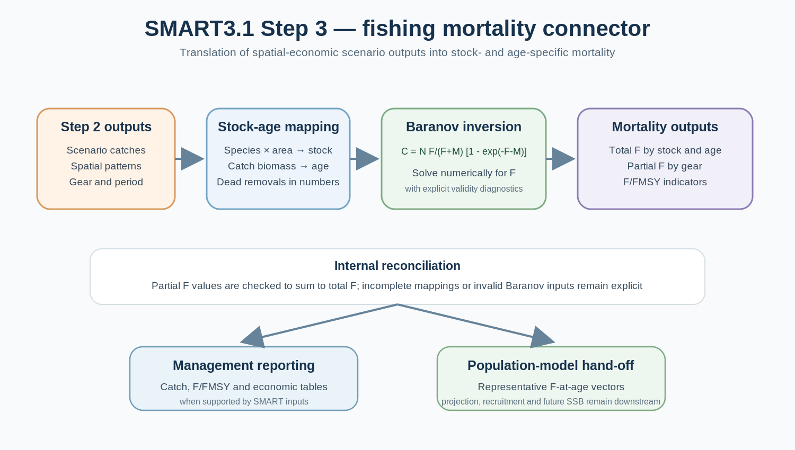

<p align="center">
  
</p>

# SMART3.1

### Spatially explicit, age-aware and bio-economic modelling for fisheries management

[](https://www.r-project.org/)
[](#development-status)
[](LICENSE)

**SMART3.1** is a modular research workflow for reconstructing spatial fisheries dynamics, evaluating management scenarios and translating their biological removals into fishing-mortality vectors. It integrates vessel activity, landings, biological surveys, environmental information and fleet economics within a common spatial and temporal framework.

The central idea is that fishing pressure, resource distribution and fleet behaviour interact in space. A management measure must therefore be assessed not only by how much effort it removes or adds, but also by **where and when fishing activity is displaced**, which catches and population components are affected, how economic performance changes, and how those removals translate into fishing mortality by stock and age.

<p align="center">
  
</p>

> **Development status.** Step 1 constructs and validates the spatial bio-economic baseline and exports a versioned simulation bundle. Step 2 converts that bundle into representative future fishing activity and redistributes effort under alternative management scenarios. Step 3 maps scenario catches to stock and age, estimates total and gear-specific fishing mortality, and prepares an auditable hand-off to downstream population modelling. SMART3.1 remains a research workflow under active case-study validation rather than a stable software release.

## Contents

- [Scientific scope](#scientific-scope)
- [Three-stage architecture](#three-stage-architecture)
- [Step 1: validated simulation baseline](#step-1-validated-simulation-baseline)
- [Step 2: management scenario simulation](#step-2-management-scenario-simulation)
- [Step 3: fishing mortality and biological interface](#step-3-fishing-mortality-and-biological-interface)
- [End-to-end workflow](#end-to-end-workflow)
- [Running SMART3.1](#running-smart31)
- [Outputs and diagnostics](#outputs-and-diagnostics)
- [Validation and interpretation](#validation-and-interpretation)
- [Repository contents](#repository-contents)
- [Reproducibility and data governance](#reproducibility-and-data-governance)
- [Development status](#development-status)
- [AI-assisted development](#ai-assisted-development)
- [Scientific lineage](#scientific-lineage)

## Scientific scope

SMART was originally developed as a spatially explicit bio-economic model for demersal trawl fisheries. SMART3.1 extends that architecture into an auditable workflow for multi-species and multi-gear case studies.

The framework connects six dimensions:

1. **Fishing activity** — vessel movements, fishing time, steaming, gear, fleet structure and access to fishing grounds.
2. **Production** — calibrated landings, spatial LPUE and the origin-to-harbour flow of catches.
3. **Population structure** — species distributions, habitat constraints and depth-dependent catch composition by age.
4. **Fleet economics** — revenues, days at sea, fuel consumption, operating costs and profitability.
5. **Management response** — vessel-level effort reallocation under spatial, temporal, selectivity, capacity and compensation measures.
6. **Fishing mortality** — translation of scenario removals into stock- and age-specific total and partial fishing mortality for downstream population analysis.

SMART3.1 is a **decision-support and Management Strategy Evaluation framework**, not a replacement for stock assessment. Step 2 represents fleet response to management against a validated spatial production and economic baseline. Step 3 converts the resulting catches into fishing mortality, but **population projection, recruitment dynamics, future abundance and biological uncertainty remain downstream tasks** unless explicitly connected to an external population model.

## Three-stage architecture

| Stage | Main question | Principal output |
|---|---|---|
| **Step 1 — set-up and validation** | What spatial biological and economic state is supported by the observed evidence? | Validated, versioned simulation bundle |
| **Step 2 — scenario simulation** | How can fishing activity be redistributed under a management rule set while respecting physical, spatial and economic constraints? | Spatial effort, catches and economic outcomes |
| **Step 3 — fishing mortality interface** | What stock- and age-specific fishing mortality is implied by the scenario removals? | F-at-age, Partial F and population-model interface |

### Step 1 — set-up and validation

Step 1 harmonises observed evidence, reconstructs the spatial biological and economic state, validates mass balance and other structural identities, and exports a self-contained simulation bundle.

### Step 2 — scenario simulation

Step 2 reads the validated bundle, constructs representative future fishing activity and searches for feasible spatial reallocations under management rules. The decision unit is centred on vessel and month, while gear, métier, cell and biological area remain inside the physical, production and economic calculations.

<p align="center">
  
</p>

### Step 3 — fishing mortality and model hand-off

Step 3 consumes Step 2 catches and spatial patterns, maps them to biological stocks and ages, converts landed biomass to dead removals in numbers, inverts the Baranov catch equation to estimate instantaneous fishing mortality, and derives gear-specific partial fishing mortality. The resulting vectors can be passed to a population model without pretending that SMART3.1 has already projected recruitment, abundance or future spawning-stock biomass.

## Step 1: validated simulation baseline

### 1. Configure the case study

A case study defines historical years, species, gears, geographical subareas, spatial resolution and modelling settings. Reference tables are standardised and checked for keys, units, ranges, duplicates and unresolved validation issues before analytical processing.

### 2. Reconstruct fleet activity and accessibility

Vessel positions are classified and interpolated into fishing activity, then aggregated over a common spatial grid. Boundary cells are assigned to the relevant management or biological area using an explicit spatial rule. Harbour-to-ground distances are calculated over navigable water rather than as straight lines across land.

<p align="center">
  
</p>

### 3. Estimate spatial LPUE and conserve catch mass

Spatial catch rates are reconstructed from observed effort and calibrated landings. The current workflow uses non-negative estimation and a final mass-conserving allocation so that, within each calibrated stratum,

$$
\sum_i E_{k,i}\widehat{\lambda}_{k,i}=C_k.
$$

This preserves non-negative production and explicit conservation of calibrated landings. Catch without compatible spatial effort support is retained as a documented biological removal rather than being assigned invented vessel effort, trips or economic costs.

<p align="center">
  
</p>

### 4. Reconstruct catch composition by age and habitat

Survey length-frequency and biomass observations are combined with growth and length-weight parameters. Depth and habitat information can modify the marginal age composition assigned to each cell, allowing management measures to affect juvenile, adult and spawning components differently in downstream analyses.

<p align="center">
  
</p>

### 5. Assemble the vessel-level bio-economic state

Fishing activity is linked to production, prices, travel time, fuel consumption and vessel economics. Economic calculations are performed at the activity level before species- or age-level expansion, avoiding duplicated costs.

The principal accounting identities are

$$
GVA=GVL-EC-OC,
\qquad
GP=GVA-LC,
\qquad
GPM=\frac{GP}{GVL}.
$$

Fishing and steaming time share an explicit physical clock, while water-constrained routes support later scenario calculations of displaced effort and energy use.

### 6. Export the Step 1 bundle

Step 1 exports a versioned RDS containing the inputs required by downstream modules, together with metadata, a manifest and checksums. Step 2 validates this hand-off before constructing scenarios.

Principal classes of inputs include the analytical grid, harbour-to-cell distances, active fleet, gridded fishing effort, mass-conserving LPUE, prices, economic activity, age-composition information and biological removals without synthetic effort.

## Step 2: management scenario simulation

Step 2 asks:

> Given a future management rule set, where can each vessel fish during each month, and what feasible spatial allocation is found by the selected search engine under the declared biological, physical and economic constraints?

<p align="center">
  
</p>

The optimiser changes the **spatial allocation of fishing activity**. The reference gear-métier structure is retained unless the scenario explicitly defines another rule. Catches, travel time, energy cost and profitability therefore respond to displaced fishing.

The search is stochastic and constrained. It should be interpreted as a reproducible search for improved feasible solutions, not as proof of a unique global mathematical optimum. Multiple replicates and comparison of search engines are recommended for substantive scenario evaluation.

### Scenario preparation

Before optimisation, Step 2:

- selects the active representative fleet;
- applies permanent cessations and temporal or spatial restrictions;
- reconciles scenario days with annual effort limits;
- treats authorised compensation days as **available rather than compulsory**;
- builds open and reachable candidate grounds;
- conditions fishing and steaming time to a synthetic daily-trip clock;
- checks catch quotas, effort quotas, crowding and local support constraints.

The historical Step 1 reference is retained separately from the conditioned initial scenario, so economic changes caused by model preparation are not silently mixed with changes produced by the optimisation itself.

### Physical and economic response

Every proposed spatial allocation updates fishing and steaming time, catch, fuel use and economics. Candidate destinations must be reachable under the configured daily-trip constraints. Energy cost therefore responds to the spatial pattern through harbour-to-cell distance and differentiated fishing and steaming fuel use when those rates are available.

### Search and convergence

The search visits vessel-month units iteratively. Feasibility constraints remain hard; the economic search determines which feasible proposals are retained. Convergence means that the configured stability rule has been reached. It does not establish a global optimum.

Live monitoring records scenario, method, sweep, GVA, distance, spatial concentration, quota use and progress. Historical GVA, conditioned initial GVA and current scenario GVA should be shown separately when interpreting the trajectory.

## Complete simulation procedure

The following detailed procedure preserves the operational description of Step 2 used in the current public README. Step 3 starts only after successful Step 2 outputs have been obtained.

### 1. Load and validate the Step 1 bundle

Step 2 selects the latest file matching `SMART31_step1_simulation_inputs_*.rds` unless the user supplies a path through:

- the `step1_bundle_file` R Markdown parameter; or
- the `SMART31_STEP1_BUNDLE` environment variable.

The simulator verifies the bundle structure, required objects, key fields, fuel price, steaming speed and spatial reference data before constructing any scenario.

### 2. Define the active future fleet

Only vessels active in the latest historical year are retained in the representative future fleet. For each retained vessel:

- observations begin in its first year of recorded activity;
- missing months and years after entry contribute zero to the representative mean;
- years before entry are excluded;
- harbour and length overall are required to be internally consistent.

This avoids treating a vessel as inactive before it entered the observed fleet while still preventing sparse post-entry histories from inflating its expected activity.

### 3. Construct the representative future baseline

Historical years are collapsed before optimisation:

- vessel activity and economic quantities become equal-year means over the vessel-specific support period;
- LPUE becomes an equal-year mean over all selected historical years;
- absent rows in the sparse LPUE table represent zero allocated LPUE;
- records labelled `historical_spatial_non_vms_proxy` are excluded from future LPUE;
- price becomes the equal-year mean by species and GSA;
- the decision table is reduced to `CFR × MONTH`, while gear, métier and cell detail is retained underneath it.

The resulting state represents one repeatable future year. Separate scenario objects may use the same baseline when management rules differ between representative periods.

### 4. Define and validate management measures

<p align="center">
  
</p>

The current scenario constructors support:

| Measure | Constructor or field | Effect |
|---|---|---|
| Spatial closure | `new_closure(id_grid = ...)` | Removes selected candidate cells |
| Temporal closure | `new_closure(months = ...)` | Removes access during selected months |
| Combined closure | `new_closure(id_grid, months, gears, cfr)` | Applies a targeted cell-month-gear-vessel restriction |
| Selectivity change | `new_selectivity_rule()` | Multiplies future LPUE without overwriting the baseline |
| Permanent cessation | `permanent_cessation_cfr` | Removes known vessels; removed effort is not redistributed |
| Compensation mechanism | `new_cm_rule()` | Adds annual fishing days to eligible vessels |

`NULL` is a wildcard in closure and selectivity rules. For example, `id_grid = NULL` with `months = 3:4` closes all cells in March and April, while `months = NULL` applies a spatial closure throughout the year.

Every compensation mechanism must identify an `associated_measure_id` that matches a closure `restriction_id` or selectivity `rule_id` in the same scenario. A CM is always an **increase in annual fishing days associated with another management measure**. It is not an independent scenario and it does not create or multiply catches directly.

### 5. Apply permanent cessation

Known CFRs in `permanent_cessation_cfr` are removed before redistribution. Their scenario activity, catch, revenue and costs are zero. Their reference economics are retained in output tables so that fleet-level scenario differences include the effect of cessation. The effort of ceased vessels is never transferred to the remaining fleet.

### 6. Calculate annual scenario days

For each eligible vessel:

$$
D^{scenario}_v=D^{reference}_v+D^{CM}_v.
$$

`D_CM` can be supplied as an absolute number of days, a fraction of reference annual days, or both. Eligibility can be restricted by CFR, gear, harbour and vessel length.

The simulator distributes annual days over open, historically active months. Every allocation must satisfy the configured monthly cap. Authorised compensation days may be treated as available rather than compulsory in research configurations that explicitly enable optional use.

The annual non-modelled-species value is distributed among scenario months according to scenario fishing-day shares. Additional CM days do not automatically inflate this fixed annual residual.

### 7. Build open and reachable candidate grounds

Candidate cells are obtained from the vessel’s historical grounds and the spatial behaviour of comparable vessels. The peer hierarchy is:

1. same harbour, month, gear and métier;
2. same harbour, month and gear;
3. own history only when peer support is unavailable.

Closed cells are removed. Candidate grounds must also have a finite water-constrained route from the vessel’s harbour. A vessel-month-gear-métier pattern with no reachable open cell is reported explicitly.

Gear and métier proportions remain tied to the reference vessel-month unless another rule is explicitly introduced. The optimiser redistributes their cell shares rather than allowing an unconstrained switch of fishing technique.

### 8. Prepare the spatial probability models

For the Bayesian engine, historical effective activity and peer behaviour define the Dirichlet posterior:

$$
\alpha_{v,m,a,c}
=n^{trip}_{v,m,a,c}+\alpha_0 q_{h,m,a,c},
$$

where $a$ denotes the gear-métier pattern, $c$ the candidate cell, $n^{trip}$ the effective historical evidence and $q$ the peer spatial distribution.

The stochastic optimiser instead centres proposals on a mixture of the current solution and peer information. Both engines generate reproducible spatial proposals while retaining method, replicate and random seed in the output.

### 9. Initialise the scenario and repair joint feasibility

The historical spatial pattern, after applying scenario restrictions and Step 2 baseline conditioning, provides the starting state. SMART3.1 checks crowding, local support, effort quotas, catch quotas and other configured constraints before economic optimisation.

The historical Step 1 reference remains separately identifiable from the conditioned scenario start. This distinction is important because a GVA increase from a reduced starting state is not the same quantity as the change from the historical reference.

### 10. Evaluate one vessel-month candidate

<p align="center">
  
</p>

For every proposed spatial allocation, SMART3.1 recalculates physical activity, production and economics.

#### Physical time

Fishing and steaming share an explicit activity clock. Destination-specific water distance affects navigation time, and physically invalid allocations are rejected. Recent Step 2 versions use synthetic daily port-ground-port trips so that the operational constraint is applied to the simulated route rather than inferred from unreliable historical track identifiers.

#### Production and prices

Cell-level effort is vessel length overall multiplied by fishing time. Scenario production is based on the reference LPUE surface and any explicitly declared selectivity effect:

$$
W_{v,m,g,a,c,s}
=E_{v,m,g,a,c}\,
LPUE^{ref}_{m,GSA,g,c,s}\,
M^{selectivity}_{m,g,c,s}.
$$

The scenario-sensitive value for modelled species is catch multiplied by the future price. Price multipliers can be applied without overwriting the Step 1 reference object.

#### Economic evaluation

Energy cost responds to fishing and steaming activity and, where supported, to their differentiated fuel-consumption rates. Other operating and labour costs use the configured vessel economic relationships. Core accounting identities remain explicit:

$$
GVA=GVL-EC-OC,
\qquad
GP=GVA-LC.
$$

### 11. Select the proposal engine

| Feature | `bayesian_dirichlet` | `stochastic_optimizer` |
|---|---|---|
| Statistical basis | Dirichlet posterior | Adaptive stochastic proposal |
| Centre | Vessel evidence plus peer prior | Current state plus controlled exploration |
| Main role | Formal probabilistic behavioural model | Direct stochastic search around feasible states |
| Shared constraints | Physical clock, closures, accessibility, quotas, crowding and economics | Same |

Set `method = "both"` when both engines are to be evaluated. Each method and replicate receives a reproducible derived seed.

### 12. Search for improved feasible GVA

The search visits vessel-month units iteratively and compares feasible candidate allocations. Depending on the selected research version, an initial controlled exploratory phase may allow temporary economic deterioration before the subsequent improvement-oriented search. These sweeps are optimiser iterations, not calendar periods.

The run stops when the configured stability rule is met or the maximum number of sweeps is reached. Convergence therefore describes the search criterion and does not prove a global optimum.

### 13. Assemble catches and biological removals

Activity-supported catches change with effort, LPUE, selectivity and location. Non-VMS landings remain a fixed biological removal under the documented treatment

`fixed_biological_removal_no_synthetic_effort_or_economics`.

They contribute to biological-removal summaries but do not generate trips, vessel activity, fuel costs or simulated vessel revenue.

### 14. Aggregate economics and compare with the reference

Outputs are retained at vessel-month scale and aggregated annually by vessel and fleet. Ceased vessels can retain their reference values while scenario activity is zero, allowing scenario deltas to include the cessation effect.

Historical, conditioned-initial and final simulated GVA should be reported separately. This avoids interpreting recovery during the optimiser as if it were necessarily an improvement relative to the historical Step 1 baseline.

### 15. Export an auditable result

Each run records scenario, year, method, replicate, seed, feasibility, convergence, accepted updates and diagnostic stage. The scientific output preserves the provenance of the Step 1 bundle and the scenario configuration used to generate it.

Recent memory-safe Step 2 versions separate complete per-run archives from compact overview and reporting objects. This reduces final rendering pressure while retaining detailed scientific results for later materialisation.

## Configuring scenarios

### Default simulation controls

Step 2 exposes controls for physical feasibility, search behaviour, crowding, stochastic proposals, replication and prices. Defaults evolve during active development; the exact values in the executed notebook and result metadata are authoritative for a particular analysis.

Typical controls include:

| Parameter | Meaning |
|---|---|
| `max_days_per_month` | Maximum vessel fishing days in a month |
| `maximum_clock_hours_per_sea_day` or trip-level equivalent | Physical activity clock |
| `min_GVA_improve_fact` | Economic improvement threshold in monotonic search |
| `min_GVA_improve_abs_eur` | Absolute tolerance near zero GVA |
| `crowding_factor` / crowding controls | Spatial concentration limit |
| `candidates_per_update` | Candidate allocations per vessel-month update |
| `maximum_sweeps` | Maximum full passes through active units |
| `max_consecutive_non_improvements` | Stability stopping rule |
| `bayesian_prior_strength` | Weight of peer information in the Bayesian engine |
| `stochastic_concentration` | Concentration around the stochastic proposal centre |
| `stochastic_exploration` | Weight assigned to exploratory proposals |
| `n_replicates` | Replicates per scenario-method combination |
| `seed` | Reproducible base seed |
| `fuel_price_multiplier` | Scenario fuel-price multiplier |
| `landing_price_multiplier` | Scenario landing-price multiplier |

### Status quo example

```r
scenarios <- list(
  new_smart31_scenario(
    scenario_id = "STATUS_QUO_2026",
    scenario_year = 2026,
    method = "both",
    closures = list(),
    compensation_mechanisms = list(),
    permanent_cessation_cfr = character(),
    selectivity_rules = list(),
    parameters = list(
      min_GVA_improve_fact = 1.05,
      max_days_per_month = 25,
      crowding_factor = 1.10,
      n_replicates = 1L,
      seed = 3101L
    )
  )
)
```

### Combined management scenario

```r
deep_closure <- new_closure(
  restriction_id = "DEEP_CLOSURE",
  id_grid = deep_closure_cells,
  gears = "OTB"
)

spring_closure <- new_closure(
  restriction_id = "SPRING_CLOSURE",
  id_grid = NULL,
  months = 3:4,
  gears = "OTB"
)

otb_selectivity <- new_selectivity_rule(
  rule_id = "OTB_SELECTIVITY_HKE",
  multiplier = 0.80,
  species = "HKE",
  gears = "OTB"
)

scenarios <- list(
  new_smart31_scenario(
    scenario_id = "OTB_PACKAGE_2026",
    scenario_year = 2026,
    method = "both",
    closures = list(deep_closure, spring_closure),
    compensation_mechanisms = list(
      new_cm_rule(
        rule_id = "CM_DEEP_CLOSURE",
        associated_measure_id = "DEEP_CLOSURE",
        extra_days_fraction = 0.10,
        eligible_gears = "OTB"
      )
    ),
    permanent_cessation_cfr = ceased_cfr,
    selectivity_rules = list(otb_selectivity),
    parameters = list(
      min_GVA_improve_fact = 1.03,
      max_days_per_month = 25,
      crowding_factor = 1.15,
      n_replicates = 20L,
      seed = 3101L
    )
  )
)
```

The objects `deep_closure_cells` and `ceased_cfr` must be prepared by the case-study user. SMART3.1 validates their use but does not infer policy lists.

### Different rules in later representative periods

When a rule or compensation mechanism changes between periods, define separate scenario objects while preserving the same validated reference unless another baseline is deliberately supplied.

## Running Step 2

The main simulation notebook is versioned during active development. Record the exact file, repository commit, Step 1 bundle checksum and scenario definition used in an analysis.

### Automatic bundle selection

Place the Step 1 principal RDS in `outputs/step1_simulation_inputs/`, edit the scenario list, and render the notebook. Versions that support automatic selection use the most recent matching bundle when no explicit path is provided.

```r
rmarkdown::render(
  "SMART3.1_Step2_Simulation_<VERSION>.Rmd",
  params = list(
    step1_bundle_file = NULL,
    output_directory = "outputs/step2_simulations"
  ),
  envir = new.env(parent = globalenv())
)
```

### Explicit bundle selection

```r
rmarkdown::render(
  "SMART3.1_Step2_Simulation_<VERSION>.Rmd",
  params = list(
    step1_bundle_file = file.path(
      "outputs", "step1_simulation_inputs",
      "SMART31_step1_simulation_inputs_YYYYMMDD_HHMMSS.rds"
    ),
    output_directory = "outputs/step2_simulations"
  ),
  envir = new.env(parent = globalenv())
)
```

Typical dependencies include `dplyr`, `tidyr`, `purrr`, `tibble`, `ggplot2`, `sf`, `scales`, `knitr` and `rmarkdown`, together with the spatial system libraries required by `sf`.

## Step 3: fishing mortality and biological interface

Step 3 is the **biological connector between the spatial-economic scenarios and downstream population modelling**. It is not merely a reporting step.

<p align="center">
  
</p>

### 1. Consume the validated hand-offs

Step 3 requires the successful Step 2 result, the exact Step 1 bundle used to create it, and a small set of controlled biological tables. These tables define:

- the mapping between SMART species-area catches and biological stock identifiers;
- stock- and age-specific abundance and natural mortality;
- mean weight, maturity and any declared landings-to-dead-removals conversion;
- reference points such as the ages used for Fbar and, where available, FMSY.

This explicit input contract prevents population parameters from being inferred silently from unrelated objects.

### 2. Allocate scenario catch to stock and age

Scenario catches are mapped from species and area to the corresponding stock and then distributed across age classes using the age-composition information prepared in Step 1. Landed biomass is converted to dead removals in numbers using controlled biological parameters.

The result is a catch-at-age representation consistent with the spatial and temporal scenario generated in Step 2.

### 3. Estimate fishing mortality by Baranov inversion

For stock $s$, age $a$ and representative period $p$, dead removals in numbers are linked to fishing mortality through the Baranov catch equation:

```math
C_{s,a,p} =
N_{s,a,p}
\frac{F_{s,a,p}}{F_{s,a,p}+M_{s,a,p}}
\left[
1-\exp\left(
-\left(F_{s,a,p}+M_{s,a,p}\right)
\right)
\right]
```

Step 3 numerically inverts this equation to obtain $F_{s,a,p}$, while retaining explicit diagnostics for invalid, incomplete or non-solvable inputs.

### 4. Derive gear-specific Partial F

Gear-specific fishing mortality is obtained by partitioning total fishing mortality according to the corresponding dead-removal shares:

```math
F_{s,a,g,p} =
F_{s,a,p}
\frac{C_{s,a,g,p}}{C_{s,a,p}}
```

A reconciliation check verifies that

```math
\sum_g F_{s,a,g,p} = F_{s,a,p}
```

within numerical tolerance. The workflow therefore provides both **total F at age** and **Partial F at age by gear**.

### 5. Build mortality indicators and management outputs

Where suitable reference points are supplied, Step 3 can calculate stock-level mortality indicators such as Fbar and F/FMSY. It also prepares management-reporting tables supported directly by SMART outputs, including scenario catches and economic indicators.

Application-specific tables that require information outside SMART3.1 — for example future population projections, biological-uncertainty variants, employment/FTE or an inverse calculation of the fishing days required to reach FMSY — remain explicitly marked as downstream requirements rather than being filled with unsupported assumptions.

### 6. Hand off to the population model

The principal biological interface contains representative F-at-age vectors with their scenario, period, stock, age, method and replicate identifiers.

**Step 3 does not recursively update population abundance.** Recruitment, future numbers-at-age, future SSB and biological uncertainty remain the responsibility of the connected population model. This separation makes the boundary between the spatial fleet model and the population dynamics explicit and auditable.

In the current application, Step 3 can distinguish a representative 2026 vector and a common annual vector for the 2027–2030 period. The latter is not a four-year cumulative mortality and must not be interpreted as an internally propagated stock projection.

## End-to-end workflow

The complete information flow is:

```text
Observed fisheries, biological and economic evidence
                         │
                         ▼
          STEP 1 — validated baseline
       spatial effort · LPUE · age structure
            fleet economics · accessibility
                         │
                         ▼
          STEP 2 — scenario simulation
      management rules · effort redistribution
        catches · travel · costs · GVA/GP
                         │
                         ▼
      STEP 3 — fishing mortality interface
       catch → stock → age → dead removals
             Baranov inversion → F
               Partial F by gear
                         │
                         ▼
     Downstream population / advice models
 recruitment · future SSB · uncertainty · advice
```

The interfaces between stages are deliberate. Step 1 does not optimise scenarios; Step 2 does not project populations; Step 3 does not invent missing population dynamics.

## Running SMART3.1

### Step 1

Render the current Step 1 notebook after configuring the case study and source data. The principal output is the versioned simulation bundle under `outputs/step1_simulation_inputs/`.

### Step 2

Render the current Step 2 notebook using the validated Step 1 bundle. Scenario definitions, management rules and search parameters are declared in the Step 2 configuration. Detailed run archives, lightweight summaries and diagnostics should be retained together.

### Step 3

Render the current Step 3 notebook after Step 2 has produced successful scenario results and the controlled stock tables have been completed. The working Step 3 implementation expects three small biological input tables:

- `SMART31_step3_stock_area_crosswalk.csv`;
- `SMART31_step3_stock_age_parameters.csv`;
- `SMART31_step3_stock_reference_points.csv`.

The exact filenames of the notebooks are versioned during active development. Analyses should record the repository commit and file checksum rather than relying only on a human-readable version label.

## Outputs and diagnostics

### Step 2 principal results

The Step 2 result preserves the principal simulation and diagnostic components. Depending on the storage version, some detailed tables may be stored directly in the principal RDS or in complete per-run archives referenced by a compact overview.

| Component | Content |
|---|---|
| `metadata` | Workflow version, creation time, Step 1 provenance, historical years and session information |
| `scenarios` | Complete user scenario definitions and parameters |
| `run_status` | Feasibility and convergence by scenario, method and replicate |
| `scenario_economic_summary` | Fleet-level reference and scenario economic totals |
| `economic_monthly` | Vessel-month days, hours, GVL, costs, GVA, GP and deltas |
| `economic_annual` | Annual vessel economics and reference comparison |
| `catches` / per-run catch archives | Activity-supported production plus fixed non-VMS biological removals |
| `convergence` | GVA, accepted updates, active search units and spatial diagnostics by sweep |
| run archives / detailed results | Complete activity, occupancy, catches and diagnostics for each run |

Step 2 also exports compact CSV summaries, live-monitor diagnostics and graphical comparisons when enabled. The HTML report is a presentation layer; the numerical archives and their provenance remain the scientific output.

### Three-stage output summary


| Stage | Principal scientific outputs | Main diagnostics |
|---|---|---|
| **Step 1** | Versioned simulation bundle; spatial effort; LPUE; age composition; vessel economics | Mass balance, data coverage, route support, economic identities |
| **Step 2** | Scenario spatial effort; catches; days and hours; GVL, EC, OC, LC, GVA and GP | Feasibility, quotas, trip clock, crowding, convergence, spatial redistribution |
| **Step 3** | Catch-at-age; total F; Partial F by gear; F/FMSY indicators; downstream F interface | Stock mapping, Baranov inversion status, partial-F reconciliation, output coverage |

### Step 2 interpretation

Fleet-level economic results should be interpreted together with vessel-level and spatial diagnostics. An increase in fleet GVA can coexist with losses for individual vessels, increased travel or stronger spatial concentration.

### Step 3 interpretation

Fishing mortality depends on the population and mortality inputs supplied to the Baranov inversion. A successful inversion does not replace stock-assessment uncertainty. Missing stock-age parameters, incomplete spatial-age allocation or biologically inconsistent removals must remain explicit in the diagnostics.

## Validation and interpretation

SMART3.1 follows several general principles:

- **Spatially explicit by construction** — grid cell and biological area remain part of analytical keys.
- **Mass conserving at set-up** — calibrated catch is reconciled against Step 1 spatial production.
- **Non-negative** — LPUE, effort and production cannot become negative through fitting or simulation.
- **Age aware** — Step 1 reconstructs age composition needed for downstream mortality analysis.
- **Individual-based behaviour** — Step 2 represents vessel-level spatial decisions through vessel-month units.
- **Physically constrained** — harbour-to-ground routes, steaming and fishing share an explicit clock.
- **Economically coherent** — activity costs are calculated without duplicating them through species-age expansion.
- **Mortality coherent** — Step 3 checks the Baranov inversion and reconciles partial F to total F.
- **Transparent stochasticity** — search methods, replicates and seeds are retained in results.
- **Fail-fast validation** — infeasible or unsupported cases are reported rather than silently modified.
- **Auditable hand-offs** — versions, checksums, scenario identifiers and temporal semantics accompany downstream interfaces.

Important boundaries include:

- Step 2 does not update biomass recursively between future years;
- convergence of a stochastic search is not proof of a global optimum;
- non-VMS catches remain biological removals without invented activity or economics;
- Step 3 estimates fishing mortality from supplied population inputs but does not perform population forecasting;
- future recruitment, SSB and biological uncertainty must come from the connected population model or assessment framework.

## Principal objects and relationships

| Object | Role | Resolution |
|---|---|---|
| `simulation_bundle` | Validated Step 1 hand-off with manifest and checksums | Run level |
| `active_fleet` | Vessels represented in the future baseline | Vessel |
| `activity_reference` | Representative spatial activity | Vessel × month × gear × métier × cell |
| `time_reference` | Representative days, trips, fishing and steaming | Vessel × month × gear |
| `lpue_reference` | Representative LPUE | Month × area × gear × species × cell |
| `price_reference` | Representative prices | Species × area |
| `peer_prior` | Comparable-vessel spatial distribution | Harbour × month × gear × métier × cell |
| `scenario` | Measures, period, engine and parameters | Scenario level |
| `scenario_context` | Eligible fleet, days, candidates, values and constraints | Scenario level |
| `state_by_unit` | Candidate spatial shares | Vessel × month × gear × métier × cell |
| `economic_monthly` | Scenario and reference vessel economics | Vessel × month |
| `economic_annual` | Annual vessel economics and deltas | Vessel × scenario period |
| `run_status` | Feasibility, convergence and failure stage | Scenario × method × replicate |
| `stock_area_crosswalk` | Maps simulated species-area catches to stocks | Species × area |
| `stock_age_parameters` | Starting abundance, M, weight, maturity and removal conversion | Stock × period × age |
| `catch_at_age_by_gear` | Dead removals by stock, age and gear | Scenario × stock × age × gear |
| `f_at_age` | Total instantaneous fishing mortality | Scenario × stock × age |
| `f_partial_by_gear` | Gear-specific Partial F | Scenario × stock × age × gear |
| `maelstrom_f_interface` | F vectors for the downstream population model in the current application | Scenario × stock × age × period |

## Design principles

- **Spatially explicit by construction** — grid cell and biological area remain part of analytical keys.
- **Mass conserving at setup** — calibrated catch is reconciled against Step 1 spatial production.
- **Non-negative** — LPUE, effort and production cannot become negative through fitting or simulation.
- **Age aware** — Step 1 reconstructs the age information required downstream.
- **Individual-based behaviour** — Step 2 represents vessel-level spatial decisions through vessel-month units.
- **Physically constrained** — water routes, steaming and fishing share an explicit clock.
- **Economically coherent** — activity costs are evaluated before species-age expansion to avoid duplication.
- **Mortality coherent** — Step 3 checks Baranov inversion and reconciles Partial F with total F.
- **Transparent stochasticity** — methods, replicates and seeds are retained in results.
- **Fail-fast validation** — infeasible or unsupported cases are reported rather than silently modified.
- **Auditable hand-offs** — versions, checksums, scenario identifiers, temporal semantics and diagnostics accompany downstream interfaces.

## Repository contents

The repository contains the evolving SMART3.1 research workflows and reusable R helpers. During active development, principal notebooks may carry versioned filenames.

Core components include:

- **Step 1 notebook** — set-up, spatial reconstruction, age structure, economics and validated bundle export;
- **Step 2 notebook** — representative scenario construction and spatial effort simulation;
- **Step 3 working notebook** — fishing-mortality conversion and population-model/management-table interface;
- [`figures/workflow/01_smart31_workflow_overview.png`](figures/workflow/01_smart31_workflow_overview.png) — the existing conceptual overview of SMART3.1;
- [`figures/workflow/02_effort_accessibility.png`](figures/workflow/02_effort_accessibility.png) — fishing effort and water-constrained accessibility;
- [`figures/workflow/03_lpue_mass_balance.png`](figures/workflow/03_lpue_mass_balance.png) — mass-conserving LPUE reconstruction;
- [`figures/workflow/04_age_depth_structure.png`](figures/workflow/04_age_depth_structure.png) — depth-dependent age structure;
- [`figures/workflow/05_bioeconomic_mse_loop.png`](figures/workflow/05_bioeconomic_mse_loop.png) — bio-economic MSE loop;
- [`figures/workflow/smart31_simulation_workflow.svg`](figures/workflow/smart31_simulation_workflow.svg) — existing Step 2 simulation workflow;
- [`figures/workflow/smart31_scenario_preparation.svg`](figures/workflow/smart31_scenario_preparation.svg) — management-measure and scenario diagram;
- [`figures/workflow/smart31_vessel_month_optimisation.svg`](figures/workflow/smart31_vessel_month_optimisation.svg) — vessel-month optimisation loop;
- [`figures/workflow/06_step3_fishing_mortality_interface.png`](figures/workflow/06_step3_fishing_mortality_interface.png) — new Step 3 mortality connector;
- [`R/load_reference_data.R`](R/load_reference_data.R) — strict loader for standardised reference datasets;
- [`data-raw/prepare_reference_data.R`](data-raw/prepare_reference_data.R) — reproducible conversion and validation of legacy inputs;
- [`docs/reference-data/README.md`](docs/reference-data/README.md) — reference-data preparation workflow;
- [`docs/reference-data/data_dictionary.csv`](docs/reference-data/data_dictionary.csv) — field definitions, units and key roles.

The Step 3 workflow is documented here even while the executable interface remains under active integration with the partitioned Step 2 output format. Documentation of the third stage should therefore not be read as a claim that every versioned working notebook is already a stable public release.

Raw fleet, vessel, price and provider-restricted economic data are not distributed automatically. Users are responsible for access rights, confidentiality, licences and case-study-specific validation.

## Reference-data quick start

From the repository root:

```bash
Rscript data-raw/prepare_reference_data.R \
  data-raw/SMART31_reference_inputs_raw.RData \
  data/reference \
  GSA12,GSA13,GSA14,GSA15,GSA16
```

Then load the validated outputs without populating the global environment:

```r
source("R/load_reference_data.R")

reference_data <- load_reference_data(
  data_dir = "data/reference",
  strict = TRUE
)
```

`strict = TRUE` is deliberate: unresolved validation errors block downstream analysis. Use `strict = FALSE` only for diagnostic inspection while source problems are being resolved.

## Reproducibility and data governance

A complete SMART3.1 application should record:

- source, version, licence and units for every external dataset;
- exact historical years, configuration and spatial reference system;
- Step 1 bundle version, manifest and checksum;
- every Step 2 scenario definition and parameter;
- search engine, replicate and seed;
- mass-balance, economic, feasibility and physical-time diagnostics;
- any catch retained as a non-VMS biological removal;
- Step 3 stock crosswalk and stock-age parameter versions;
- natural mortality, abundance and reference-point sources used for fishing-mortality calculation;
- Baranov inversion and partial-F reconciliation diagnostics;
- the repository commit and R session information.

This repository does not confer permission to redistribute third-party or confidential fisheries data. The repository licence applies to material owned by the repository authors, not automatically to external inputs.

## Development status

The research implementation now contains or actively develops:

- a validated spatial and bio-economic Step 1 baseline;
- water-constrained harbour-to-cell accessibility;
- calibrated landings and mass-conserving spatial LPUE;
- depth-dependent catch composition by age;
- fishing/steaming fuel accounting and annual vessel economics;
- a versioned Step 1 simulation bundle;
- representative future fishing activity;
- spatial, temporal, cessation, selectivity and compensation measures;
- constrained stochastic spatial reallocation of vessel effort;
- feasibility, quota, physical-time, spatial, biological and economic diagnostics;
- stock-area and age allocation of Step 2 scenario catches;
- numerical inversion of the Baranov catch equation;
- total F-at-age and gear-specific Partial F;
- an explicit interface to downstream population modelling and management reporting.

The public repository remains an **active development codebase**. Case-study testing, modularisation, unit tests, performance work, stable example data and tighter Step 2–Step 3 integration are continuing.

## AI-assisted development

ChatGPT and Codex by OpenAI contributed to the development and documentation process through code review, modularisation, validation design, diagnostic workflows, methodological documentation, formulas and diagrams.

Scientific assumptions, methodological decisions, source-data validation and final responsibility for SMART3.1 remain with the project author and collaborators. AI assistance is documented for transparency and does not replace scientific review, reproducibility checks or domain accountability.

## Scientific lineage

SMART3.1 builds on the original SMART bio-economic framework, the integration of landings and VMS data, multi-species simulation of management measures and the modular `smartR` implementation.

### References

- Russo, T. et al. (2014). **SMART: A Spatially Explicit Bio-Economic Model for Assessing and Managing Demersal Fisheries, with an Application to Italian Trawlers in the Strait of Sicily.** *PLoS ONE*, 9(1), e86222. https://doi.org/10.1371/journal.pone.0086222
- Russo, T. et al. (2018). **A model combining landings and VMS data to estimate landings by fishing ground and harbor.** *Fisheries Research*, 199, 218–230. https://doi.org/10.1016/j.fishres.2017.11.002
- Russo, T. et al. (2019). **Simulating the Effects of Alternative Management Measures of Trawl Fisheries in the Central Mediterranean Sea: Application of a Multi-Species Bio-economic Modeling Approach.** *Frontiers in Marine Science*, 6, 542. https://doi.org/10.3389/fmars.2019.00542
- D'Andrea, L. et al. (2020). **smartR: An R package for spatial modelling of fisheries and scenario simulation of management strategies.** *Methods in Ecology and Evolution*. https://doi.org/10.1111/2041-210X.13394
- Sala, A. et al. (2022). **Energy audit and carbon footprint in trawl fisheries.** *Scientific Data*, 9, 428. https://doi.org/10.1038/s41597-022-01478-0

## Citation

Until a dedicated SMART3.1 software release and `CITATION.cff` are published, cite the methodological paper or papers corresponding to the modules used. When reporting a SMART3.1 application, also record the repository commit, Step 1 bundle checksum, case-study configuration, scenario definition, search engine, random seed and Step 3 biological-input versions where applicable.

## Contributing

SMART3.1 is research software under active development. Contributions are welcome through [GitHub issues](https://github.com/tommaso-russo/SMART3.1/issues), particularly for reproducible configurations, legally shareable validation data, tests, documentation and performance improvements that preserve numerical, physical and mass-balance safeguards.

## Licence

Repository-owned code and documentation are released under [CC0 1.0 Universal](LICENSE), unless otherwise stated. External data, scientific publications and provider-derived parameters remain subject to their original terms and permissions.

---

The vector diagrams in this README were prepared specifically for SMART3.1. They are explanatory workflow graphics rather than maps, measurements or quantitative model outputs.
