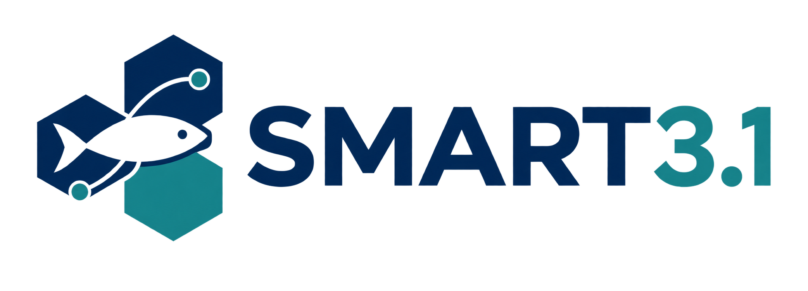
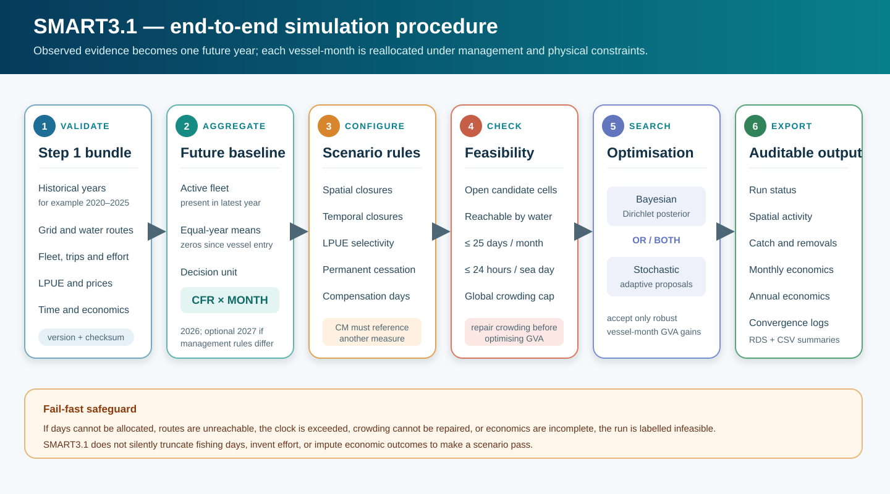
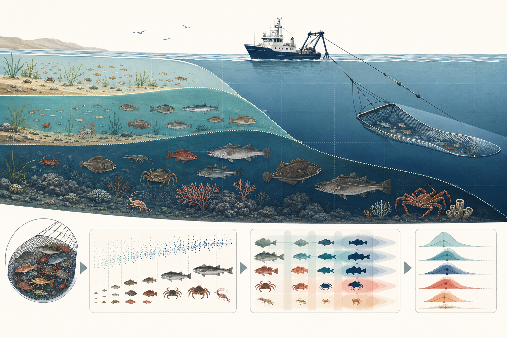
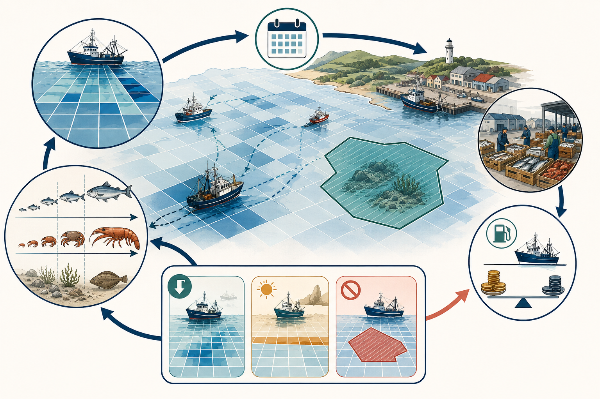
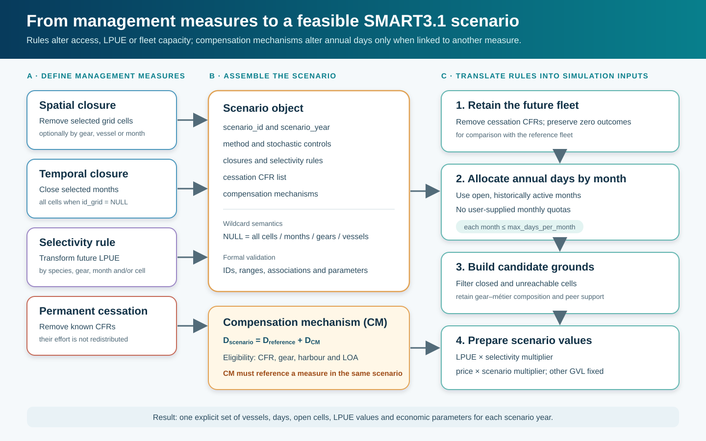
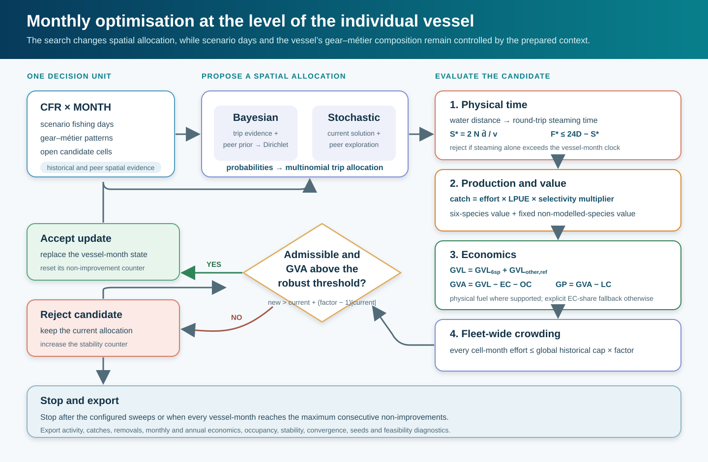

<p align="center">
  
</p>

# SMART3.1

### Spatially explicit, age-aware and bio-economic modelling for fisheries management

[](https://www.r-project.org/)
[](#development-status)
[](LICENSE)

**SMART3.1** is a modular research workflow for reconstructing spatial fisheries dynamics and evaluating alternative management strategies. It integrates vessel activity, landings, biological surveys, environmental information and fleet economics within a common spatial and temporal framework.

The central idea is that fishing pressure, resource distribution and fleet behaviour interact in space. A management measure must therefore be assessed not only by how much effort it removes or adds, but also by **where and when fishing activity is displaced**, which catches and population components are affected, and how the economic performance of individual vessels changes.

<p align="center">
  
</p>

> **Development status.** Step 1 constructs and validates the spatial bio-economic baseline and exports a versioned simulation bundle. Step 2 converts that bundle into a representative future year and redistributes fishing activity under alternative management scenarios. The implementation remains a research workflow under active case-study validation rather than a stable software release.

## Contents

- [Scientific scope](#scientific-scope)
- [Two-stage architecture](#two-stage-architecture)
- [Step 1: validated simulation baseline](#step-1-validated-simulation-baseline)
- [Step 2: management scenario simulation](#step-2-management-scenario-simulation)
- [Complete simulation procedure](#complete-simulation-procedure)
- [Configuring scenarios](#configuring-scenarios)
- [Running Step 2](#running-step-2)
- [Outputs and diagnostics](#outputs-and-diagnostics)
- [Validation and interpretation](#validation-and-interpretation)
- [Repository contents](#repository-contents)
- [Scientific lineage](#scientific-lineage)

## Scientific scope

SMART was originally developed as a spatially explicit bio-economic model for demersal trawl fisheries. SMART3.1 extends that architecture into an auditable workflow for multi-species and multi-gear case studies.

The framework connects five dimensions:

1. **Fishing activity** — vessel movements, fishing time, steaming, gear, fleet structure and access to fishing grounds.
2. **Production** — calibrated landings, spatial LPUE and the origin-to-harbour flow of catches.
3. **Population structure** — species distributions, habitat constraints and depth-dependent catch composition by age.
4. **Fleet economics** — revenues, days at sea, fuel consumption, operating costs and profitability.
5. **Management response** — vessel-level effort reallocation under spatial, temporal, selectivity and capacity measures.

SMART3.1 is a **decision-support and Management Strategy Evaluation framework**, not a replacement for stock assessment. The current Step 2 simulator reallocates activity against a representative LPUE and price baseline. It reports scenario catches and biological removals, but it does not project stock dynamics from one future year to the next.

## Two-stage architecture

### Step 1 — set up and validation

Step 1 harmonises the observed evidence, reconstructs the spatial biological and economic state, validates all required identities and exports a self-contained simulation bundle.

### Step 2 — scenario simulation

Step 2 reads the validated bundle, constructs one representative future year and optimises the spatial activity of each vessel-month. The simulator can run 2026 and, when rules differ, an additional scenario for 2027. A scenario year selects a management rule set; it is not a population projection step.

The principal decision unit is

$$
u = CFR \times MONTH.
$$

`YEAR` is deliberately excluded from the optimisation. Historical years, for example 2020–2025, provide evidence for the representative future state. Gear, métier, grid cell and biological area remain within the physical, production and economic calculations.

<p align="center">
  
</p>

## Step 1: validated simulation baseline

### 1. Configure the case study

A case study defines historical years, species, gears, geographical subareas, spatial resolution and modelling settings. Reference tables are loaded into named objects. Keys, units, ranges, duplicates and unresolved validation issues are checked before analytical processing.

### 2. Reconstruct fleet activity and accessibility

Vessel positions are classified and interpolated into fishing activity, then aggregated over a common spatial grid. Boundary cells are assigned to the General Fisheries Commission for the Mediterranean geographical subarea (GSA) with the largest intersected area. Harbour-to-ground distances are calculated over water rather than as straight lines across land.

<p align="center">
  
</p>

### 3. Estimate spatial LPUE and conserve catch mass

Within each year-month-area-species-gear stratum, non-negative least squares estimates spatial catch rates:

$$
\widehat{\boldsymbol{\lambda}}
=\arg\min_{\boldsymbol{\lambda}\geq 0}
\left\|\mathbf{A}\boldsymbol{\lambda}-\mathbf{c}\right\|_2^2,
$$

where $\mathbf{A}$ represents gridded vessel effort and $\mathbf{c}$ contains calibrated vessel catches. The final allocation is normalised so that

$$
\sum_i E_{k,i}\widehat{\lambda}_{k,i}=C_k.
$$

This guarantees non-negative production and explicit conservation of landings mass. When declared catch has no target-year VMS support, it is preserved as an explicit non-VMS biological removal rather than being assigned invented vessel effort, trips or economic costs.

<p align="center">
  
</p>

### 4. Reconstruct catch composition by age and habitat

Survey length-frequency and biomass observations are combined with growth and length-weight parameters. A depth-dependent model modifies marginal age composition by cell:

$$
p_{a,i}=
\frac{\pi_a r_a(d_i)}
{\sum_{a^\prime}\pi_{a^\prime}r_{a^\prime}(d_i)},
\qquad \sum_a p_{a,i}=1.
$$

Spatial measures can therefore affect juveniles, adults and spawning biomass differently in downstream analyses.

<p align="center">
  
</p>

### 5. Assemble the vessel-level bio-economic state

The activity model connects vessels, months, gears, métiers, fishing grounds, harbours, effort, production and prices. Economic calculations occur once per activity before species or age expansion, avoiding duplicated costs.

Total gross value of landings is separated into a scenario-sensitive modelled-species component and a reference residual for other species:

$$
GVL^{total}=GVL^{modelled}+GVL^{other,ref}.
$$

The accounting identities are

$$
GVA=GVL^{total}-EC-OC,
\qquad
GP=GVA-LC,
\qquad
GPM=\frac{GP}{GVL^{total}}.
$$

FDI days at sea provide the annual activity reference. They are allocated to vessel-month records using observed VMS activity shares. Invalid annual references are excluded from direct calibration and replaced through an explicitly labelled hierarchy. Fishing and steaming hours are reconciled with the physical 24-hour clock, and water-constrained routes support the later simulation of displaced activity.

### 6. Export the Step 1 bundle

Step 1 exports a versioned RDS containing the inputs required by the simulator, together with metadata, a manifest and checksums. Step 2 refuses a bundle that lacks required objects or structural fields.

Principal inputs include:

| Input | Role in Step 2 |
|---|---|
| `years_to_submit` | Historical support and latest observed year |
| `grid_sf`, `grid_gsa_lookup` | Grid geometry and biological/economic area assignment |
| `df_harbs_grid_dists` | Water-constrained harbour-to-cell distances |
| `final_fleet`, `annual_trips` | Active fleet, entry years and trip evidence |
| `IBM_effort` | Vessel-month-gear-métier-cell activity history |
| `df_lpue_rates_mass_conserving` | Historical spatial LPUE |
| `price_annual` | Annual price by species and GSA |
| `economic_activity_baseline` | Days, trips, fishing, steaming and fuel parameters |
| `IBM.eco` | Vessel economic reference and EC/OC/LC shares |
| `vessel_other_gvl_reference` | Fixed annual value of non-modelled species |
| `non_vms_spatial_allocation`, `non_vms_landings_ledger` | Biological removals without synthetic activity |
| `fuel_cost`, `steaming_speed` | Physical and economic scenario parameters |

## Step 2: management scenario simulation

Step 2 asks the following operational question:

> Given a future management rule set, where can each vessel fish during each month, and which feasible spatial allocation produces the best vessel-month GVA found by the selected search engine?

<p align="center">
  
</p>

The optimiser changes the **spatial allocation** of fishing activity. Scenario days are prepared before optimisation, and the vessel’s reference gear-métier composition is retained. This preserves an interpretable behavioural unit while allowing catches, travel time, fuel use and profitability to respond to displaced fishing.

The search is stochastic and constrained. It should be interpreted as a reproducible search for improved feasible solutions, not as proof of a unique global mathematical optimum. Multiple replicates and comparison of the two engines are therefore recommended for substantive scenario evaluation.

## Complete simulation procedure

### 1. Load and validate the Step 1 bundle

Step 2 selects the latest file matching `SMART31_step1_simulation_inputs_*.rds` unless the user supplies a path through:

- the `step1_bundle_file` R Markdown parameter; or
- the `SMART31_STEP1_BUNDLE` environment variable.

The simulator verifies the bundle structure, required objects, key fields, fuel price, steaming speed and spatial reference data before constructing any scenario.

### 2. Define the active future fleet

Only vessels active in the latest historical year are retained in the representative future fleet. For each retained vessel:

- observations begin in its first year of recorded activity;
- missing months and years after entry contribute zero to the representative mean;
- years before entry are excluded;
- harbour and length overall are required to be internally consistent.

This avoids treating a vessel as inactive before it entered the observed fleet while still preventing sparse post-entry histories from inflating its expected activity.

### 3. Construct the representative future baseline

Historical years are collapsed before optimisation:

- vessel activity and economic quantities become equal-year means over the vessel-specific support period;
- LPUE becomes an equal-year mean over all selected historical years;
- absent rows in the sparse LPUE table represent zero allocated LPUE;
- records labelled `historical_spatial_non_vms_proxy` are excluded from future LPUE;
- price becomes the equal-year mean by species and GSA;
- the decision table is reduced to `CFR × MONTH`, while gear, métier and cell detail is retained underneath it.

The resulting state represents one repeatable future year. Separate 2026 and 2027 scenario objects may use the same baseline when management rules differ between years.

### 4. Define and validate management measures

<p align="center">
  
</p>

The current scenario constructors support:

| Measure | Constructor or field | Effect |
|---|---|---|
| Spatial closure | `new_closure(id_grid = ...)` | Removes selected candidate cells |
| Temporal closure | `new_closure(months = ...)` | Removes access during selected months |
| Combined closure | `new_closure(id_grid, months, gears, cfr)` | Applies a targeted cell-month-gear-vessel restriction |
| Selectivity change | `new_selectivity_rule()` | Multiplies future LPUE without overwriting the baseline |
| Permanent cessation | `permanent_cessation_cfr` | Removes known vessels; removed effort is not redistributed |
| Compensation mechanism | `new_cm_rule()` | Adds annual fishing days to eligible vessels |

`NULL` is a wildcard in closure and selectivity rules. For example, `id_grid = NULL` with `months = 3:4` closes all cells in March and April, while `months = NULL` applies a spatial closure throughout the year.

Every compensation mechanism must identify an `associated_measure_id` that matches a closure `restriction_id` or selectivity `rule_id` in the same scenario. A CM is always an **increase in annual fishing days associated with another management measure**. It is not an independent scenario and it does not create or multiply catches directly.

### 5. Apply permanent cessation

Known CFRs in `permanent_cessation_cfr` are removed before redistribution. Their scenario activity, catch, revenue and costs are zero. Their reference economics are retained in output tables so that fleet-level scenario differences include the effect of cessation. The effort of ceased vessels is never transferred to the remaining fleet.

### 6. Calculate annual scenario days

For each eligible vessel:

$$
D^{scenario}_v=D^{reference}_v+D^{CM}_v.
$$

`D_CM` can be supplied as an absolute number of days, a fraction of reference annual days, or both. Eligibility can be restricted by CFR, gear, harbour and vessel length.

The simulator then distributes annual days over **open, historically active months**. The user does not need to provide monthly quotas. Every allocation must satisfy

$$
0 \leq D_{v,m} \leq D^{max}_{month},
$$

where `max_days_per_month` is 25 by default. If the annual total cannot fit into the available months, the scenario is infeasible; days are not silently discarded.

The annual non-modelled-species value is distributed among scenario months according to scenario fishing-day shares. Additional CM days do not inflate this fixed annual residual.

### 7. Build open and reachable candidate grounds

Candidate cells are obtained from the vessel’s historical grounds and the spatial behaviour of comparable vessels. The peer hierarchy is:

1. same harbour, month, gear and métier;
2. same harbour, month and gear;
3. own history only when peer support is unavailable.

Closed cells are removed. Candidate grounds must also have a finite water-constrained route from the vessel’s harbour. A vessel-month-gear-métier pattern with no reachable open cell makes the scenario infeasible.

Gear and métier proportions are retained from the reference vessel-month. The optimiser redistributes their cell shares rather than allowing an unconstrained switch of fishing technique.

### 8. Prepare the spatial probability models

For the formal Bayesian engine, historical effective trip counts and peer behaviour define the Dirichlet posterior:

$$
\alpha_{v,m,a,c}
=n^{trip}_{v,m,a,c}+\alpha_0 q_{h,m,a,c},
$$

where $a$ denotes the gear-métier pattern, $c$ the candidate cell, $n^{trip}$ the effective historical trip evidence and $q$ the peer spatial distribution.

The stochastic optimiser instead centres proposals on a mixture of the current solution and the peer distribution. Both engines convert sampled probabilities to discrete cell allocations through a multinomial trip draw, allowing historically unused but supported cells to receive zero or positive activity in a particular proposal.

### 9. Initialise the scenario and repair crowding

The historical spatial pattern, after applying scenario restrictions, provides the initial state. SMART3.1 calculates total effort in every cell-month and applies a single global crowding threshold:

$$
E^{cap}=f^{crowding}\max_{c,m}\left(E^{historical}_{c,m}\right).
$$

The numerical cap is the same for every cell; it does not depend on local cell history. The default `crowding_factor` is 1.10.

If closure-driven displacement overloads one or more cells, a preliminary stochastic repair stage searches only for a crowding-feasible state. GVA optimisation starts after crowding is repaired. Failure to find such a state is reported explicitly.

### 10. Evaluate one vessel-month candidate

<p align="center">
  
</p>

For every proposed spatial allocation, SMART3.1 recalculates physical activity, production and economics.

#### Physical time

For a vessel-month-gear with $N$ trips, mean water distance $\bar d$ and steaming speed $v$:

$$
S^{*}=\frac{2N\bar d}{v}.
$$

Available time is bounded by sea days:

$$
T^{available}=24D.
$$

Fishing time responds to the change in steaming through the configured elasticity $\varepsilon$ and is capped by the remaining physical clock:

$$
F^{*}=\min\left[
\max\left(0,F^{ref}-\varepsilon(S^{*}-S^{ref})\right),
\max\left(0,24D-S^{*}\right)
\right].
$$

If steaming alone exceeds `maximum_clock_hours_per_sea_day × days_scenario_gear`, the candidate is rejected.

#### Production and prices

Cell-level effort is vessel length overall multiplied by fishing time. Scenario production is

$$
W_{v,m,g,a,c,s}
=E_{v,m,g,a,c}\,
LPUE^{ref}_{m,GSA,g,c,s}\,
M^{selectivity}_{m,g,c,s}.
$$

The scenario-sensitive value for modelled species is catch multiplied by the future price. `landing_price_multiplier` can apply a common scenario multiplier without modifying the Step 1 price object.

#### Economic evaluation

For gears with valid fishing and steaming fuel rates:

$$
FC=q^{fish}F^{*}+q^{steam}S^{*},
\qquad EC=FC\times P^{fuel}.
$$

When a physical fuel model is unavailable, EC is calculated through the explicit vessel-gear `EC_share`. Other costs and labour costs use `OC_share` and `LC_share`:

$$
OC=GVL\times OC_{share},
\qquad
LC=GVL\times LC_{share}.
$$

The legacy procedure based on `IBM2eco2`, `add_WLV2`, `tpar`, `OCfact`, `INVfact`, `LCfact` and subsequent correction factors is not used in Step 2.

### 11. Select the proposal engine

| Feature | `bayesian_dirichlet` | `stochastic_optimizer` |
|---|---|---|
| Statistical basis | Dirichlet posterior | Adaptive Dirichlet proposal |
| Centre | Vessel trip evidence plus peer prior | Current state plus controlled peer exploration |
| Discrete allocation | Posterior-predictive multinomial draw | Multinomial draw from adaptive probabilities |
| Main role | Formal probabilistic behavioural model | Direct stochastic search around improving states |
| Shared constraints | Physical clock, closures, accessibility, monthly days, crowding and economics | Same |

Set `method = "both"` to run the same scenario with both engines. Each method and replicate receives a reproducible derived seed.

### 12. Accept only robust GVA improvements

For each vessel-month, the simulator generates `candidates_per_update` proposals and retains the admissible candidate with the greatest GVA. An update is accepted only when

$$
GVA^{new}
>
GVA^{current}
+(f^{GVA}-1)\left|GVA^{current}\right|,
$$

with an additional absolute tolerance near zero. The user controls `min_GVA_improve_fact`; the default is 1.05. The absolute-value formulation also defines a genuine improvement when current GVA is negative.

The search visits vessel-month units in random order. An accepted update resets that unit’s stability counter. A rejected update increases it. The run stops when:

- every vessel-month reaches `max_consecutive_non_improvements`; or
- `maximum_sweeps` is reached.

Convergence means that the configured stability rule was reached. It does not prove a global optimum.

### 13. Assemble catches and biological removals

Activity-supported catches change with effort, LPUE, selectivity and location. Non-VMS landings remain a fixed biological removal with treatment

`fixed_biological_removal_no_synthetic_effort_or_economics`.

They contribute to biological-removal summaries but do not generate trips, vessel activity, fuel costs or simulated vessel revenue.

### 14. Aggregate economics and compare with the reference

Outputs are first retained at vessel-month scale and then aggregated annually by vessel. Ceased vessels appear with zero scenario values and their original reference values. For every retained or ceased vessel, the simulator calculates scenario values, reference values and deltas for GVL, EC, OC, LC, GVA and GP.

### 15. Export an auditable result

Each run records scenario, year, method, replicate, seed, feasibility, convergence, accepted updates and diagnostic stage. The principal RDS also includes the scenario definitions, Step 1 bundle path and MD5, historical years, detailed results and `sessionInfo()`.

## Configuring scenarios

### Default simulation controls

The Step 2 notebook currently defines the following defaults:

| Parameter | Default | Meaning |
|---|---:|---|
| `max_days_per_month` | 25 | Maximum realistic vessel fishing days in a month |
| `maximum_clock_hours_per_sea_day` | 24 | Physical activity clock |
| `min_GVA_improve_fact` | 1.05 | Minimum multiplicative GVA improvement |
| `min_GVA_improve_abs_eur` | 1 | Absolute tolerance for near-zero GVA |
| `crowding_factor` | 1.10 | Multiplier of the global historical cell-month maximum |
| `candidates_per_update` | 10 | Candidate allocations per vessel-month update |
| `maximum_sweeps` | 40 | Maximum full passes through the active units |
| `max_consecutive_non_improvements` | 8 | Stability stopping rule per vessel-month |
| `maximum_crowding_repair_iterations` | 500 | Limit for preliminary feasibility repair |
| `bayesian_prior_strength` | 5 | Weight of the peer prior |
| `stochastic_concentration` | 80 | Concentration around the stochastic proposal centre |
| `stochastic_exploration` | 0.15 | Weight assigned to peer exploration |
| `minimum_dirichlet_alpha` | 1e-8 | Positive floor for proposal parameters |
| `n_replicates` | 1 | Replicates per scenario-method combination |
| `seed` | 3101 | Reproducible base seed |
| `fuel_price_multiplier` | 1 | Scenario fuel-price multiplier |
| `landing_price_multiplier` | 1 | Scenario landing-price multiplier |
| `fishing_time_elasticity_override` | `NA` | Optional common elasticity; otherwise use Step 1 values |

Parameters are scenario-specific. For final analyses, increase `n_replicates` and assess the stability of economic and spatial outcomes across seeds and engines.

### Status quo example

```r
scenarios <- list(
  new_smart31_scenario(
    scenario_id = "STATUS_QUO_2026",
    scenario_year = 2026,
    method = "both",
    closures = list(),
    compensation_mechanisms = list(),
    permanent_cessation_cfr = character(),
    selectivity_rules = list(),
    parameters = list(
      min_GVA_improve_fact = 1.05,
      max_days_per_month = 25,
      crowding_factor = 1.10,
      n_replicates = 1L,
      seed = 3101L
    )
  )
)
```

### Combined management scenario

```r
deep_closure <- new_closure(
  restriction_id = "DEEP_CLOSURE",
  id_grid = deep_closure_cells,
  gears = "OTB"
)

spring_closure <- new_closure(
  restriction_id = "SPRING_CLOSURE",
  id_grid = NULL,
  months = 3:4,
  gears = "OTB"
)

otb_selectivity <- new_selectivity_rule(
  rule_id = "OTB_SELECTIVITY_HKE",
  multiplier = 0.80,
  species = "HKE",
  gears = "OTB"
)

scenarios <- list(
  new_smart31_scenario(
    scenario_id = "OTB_PACKAGE_2026",
    scenario_year = 2026,
    method = "both",
    closures = list(deep_closure, spring_closure),
    compensation_mechanisms = list(
      new_cm_rule(
        rule_id = "CM_DEEP_CLOSURE",
        associated_measure_id = "DEEP_CLOSURE",
        extra_days_fraction = 0.10,
        eligible_gears = "OTB"
      )
    ),
    permanent_cessation_cfr = ceased_cfr,
    selectivity_rules = list(otb_selectivity),
    parameters = list(
      min_GVA_improve_fact = 1.03,
      max_days_per_month = 25,
      crowding_factor = 1.15,
      n_replicates = 20L,
      seed = 3101L
    )
  )
)
```

The objects `deep_closure_cells` and `ceased_cfr` must be prepared by the case-study user. SMART3.1 validates their use but does not infer policy lists.

### Different rules in 2027

When a rule or CM changes in 2027, define a second scenario with `scenario_year = 2027`. Both years use the representative historical baseline unless the analyst deliberately supplies another Step 1 bundle.

```r
scenarios <- list(
  scenario_2026,
  scenario_2027
)
```

## Running Step 2

The main simulation notebook is:

[`SMART3.1_Step2_Simulation_V2026_08_18_ILLUSTRATED_v1.Rmd`](SMART3.1_Step2_Simulation_V2026_08_18_ILLUSTRATED_v1.Rmd)

### Automatic bundle selection

Place the Step 1 principal RDS in `outputs/step1_simulation_inputs/`, edit the `scenarios` list, and render the notebook. The most recently modified matching bundle is selected automatically.

```r
rmarkdown::render(
  "SMART3.1_Step2_Simulation_V2026_08_18_ILLUSTRATED_v1.Rmd",
  params = list(
    step1_bundle_file = NULL,
    output_directory = "outputs/step2_simulations"
  ),
  envir = new.env(parent = globalenv())
)
```

### Explicit bundle selection

```r
rmarkdown::render(
  "SMART3.1_Step2_Simulation_V2026_08_18_ILLUSTRATED_v1.Rmd",
  params = list(
    step1_bundle_file = file.path(
      "outputs",
      "step1_simulation_inputs",
      "SMART31_step1_simulation_inputs_YYYYMMDD_HHMMSS.rds"
    ),
    output_directory = "outputs/step2_simulations"
  ),
  envir = new.env(parent = globalenv())
)
```

The notebook requires `dplyr`, `tidyr`, `purrr`, `tibble`, `ggplot2`, `sf`, `scales`, `knitr` and `rmarkdown`, together with the spatial system libraries required by `sf`.

## Outputs and diagnostics

### Principal RDS

The file `SMART31_step2_simulation_results_<timestamp>.rds` contains:

| Component | Content |
|---|---|
| `metadata` | Workflow version, creation time, bundle path and MD5, historical years and session information |
| `scenarios` | Complete user scenario definitions and parameters |
| `run_status` | Feasibility and convergence by scenario, method and replicate |
| `scenario_economic_summary` | Fleet-level reference and scenario economic totals |
| `economic_monthly` | Vessel-month days, hours, catch, GVL, costs, GVA, GP and deltas |
| `economic_annual` | Annual vessel economics and reference comparison |
| `catches` | Activity-supported production plus fixed non-VMS biological removals |
| `convergence` | GVA, accepted updates, active search units and crowding ratio by sweep |
| `results` | Complete nested run objects, activity, occupancy, stability and diagnostics |

### CSV summaries

Step 2 also exports:

- `SMART31_step2_run_status_<timestamp>.csv`;
- `SMART31_step2_economic_summary_<timestamp>.csv`, when feasible results exist.

The rendered report prints the run-status and economic tables and includes plots of GVA convergence and vessel-level reference versus scenario GVA.

### Main infeasibility conditions

A run is labelled infeasible when, for example:

- annual days cannot be distributed across open historical months without exceeding `max_days_per_month`;
- an active gear-métier pattern has no reachable open cell;
- steaming exceeds the vessel-month physical clock;
- the initial state is physically or economically invalid;
- no state satisfying the global crowding cap is found;
- catches, prices or economic inputs are incomplete.

The `stage`, `issue` and detailed diagnostic object identify where the run failed. Constraints are not weakened automatically and values are not truncated or imputed to force completion.

## Validation and interpretation

### What should be compared across scenarios

At minimum, compare:

- feasibility rate by engine and replicate;
- convergence and accepted-update trajectories;
- distribution of annual vessel GVA and the number of losing vessels;
- fleet GVL, EC, OC, LC, GVA and GP;
- days, fishing hours, steaming hours and energy cost;
- cell-month occupancy and proximity to the crowding cap;
- catches and biological removals by species, GSA, gear, month and cell;
- results across both engines and stochastic replicates.

An increase in fleet GVA can coexist with losses for individual vessels or increased spatial concentration. Fleet totals should therefore never be interpreted without vessel-level and spatial diagnostics.

### Important modelling boundaries

- The future baseline is stationary; Step 2 does not update biomass between 2026 and 2027.
- The optimiser searches vessel-month spatial allocations and does not freely replace gear or métier.
- The crowding limit is a global maximum independent of the identity of the cell.
- CM adds fishing days but does not automatically increase the fixed other-species annual GVL.
- Selectivity is implemented through an LPUE multiplier; the baseline LPUE object is preserved.
- Permanent cessation removes listed vessels and does not redistribute their effort.
- Non-VMS catches remain biological removals without synthetic effort or economics.
- A converged stochastic search is not proof of the global optimum.

## Principal objects and relationships

| Object | Role | Resolution |
|---|---|---|
| `simulation_bundle` | Validated Step 1 hand-off with manifest and checksums | Run level |
| `active_fleet` | Vessels present in the latest historical year | Vessel |
| `activity_reference` | Representative spatial activity | Vessel × month × gear × métier × cell |
| `time_reference` | Representative days, trips, fishing and steaming | Vessel × month × gear |
| `lpue_reference` | Equal-year future LPUE | Month × GSA × gear × species × cell |
| `price_reference` | Equal-year future prices | Species × GSA |
| `peer_prior` | Comparable-vessel spatial distribution | Harbour × month × gear × métier × cell |
| `scenario` | Measures, year, engine and parameters | Scenario level |
| `scenario_context` | Eligible fleet, days, candidates, values and constraints | Scenario level |
| `state_by_unit` | Candidate spatial shares | Vessel × month × gear × métier × cell |
| `economic_monthly` | Scenario and reference vessel economics | Vessel × month |
| `economic_annual` | Annual vessel economics and deltas | Vessel × scenario year |
| `run_status` | Feasibility, convergence and failure stage | Scenario × method × replicate |

## Design principles

- **Spatially explicit by construction** — grid cell and GSA remain part of analytical keys.
- **Mass conserving at setup** — calibrated catch is reconciled against Step 1 spatial production.
- **Non-negative** — LPUE, effort and production cannot become negative through fitting or simulation.
- **Age aware** — Step 1 can reconstruct depth-dependent catch composition by age.
- **Individual-based behaviour** — optimisation occurs at `CFR × MONTH`.
- **Physically constrained** — water routes, steaming and fishing share an explicit clock.
- **Economically coherent** — activity costs are evaluated once at the vessel-month-gear scale.
- **Transparent stochasticity** — methods, replicates and seeds are retained in every result.
- **Fail-fast validation** — infeasible scenarios are reported rather than silently modified.
- **Auditable outputs** — versions, manifests, checksums, parameters and diagnostics accompany results.

## Repository contents

- [`SMART3.1_Step1_Set_Up_V2026_08_18_ILLUSTRATED_v6.1.Rmd`](SMART3.1_Step1_Set_Up_V2026_08_18_ILLUSTRATED_v6.1.Rmd) — current Step 1 research workflow.
- [`SMART3.1_Step2_Simulation_V2026_08_18_ILLUSTRATED_v1.Rmd`](SMART3.1_Step2_Simulation_V2026_08_18_ILLUSTRATED_v1.Rmd) — vessel-month management scenario simulator.
- [`figures/workflow/01_smart31_workflow_overview.png`](figures/workflow/01_smart31_workflow_overview.png) — conceptual overview of SMART3.1.
- [`figures/workflow/02_effort_accessibility.png`](figures/workflow/02_effort_accessibility.png) — fishing effort and water-constrained accessibility.
- [`figures/workflow/03_lpue_mass_balance.png`](figures/workflow/03_lpue_mass_balance.png) — mass-conserving LPUE reconstruction.
- [`figures/workflow/04_age_depth_structure.png`](figures/workflow/04_age_depth_structure.png) — depth-dependent age structure.
- [`figures/workflow/05_bioeconomic_mse_loop.png`](figures/workflow/05_bioeconomic_mse_loop.png) — bio-economic MSE loop.
- [`figures/workflow/smart31_simulation_workflow.svg`](figures/workflow/smart31_simulation_workflow.svg) — end-to-end simulation diagram.
- [`figures/workflow/smart31_scenario_preparation.svg`](figures/workflow/smart31_scenario_preparation.svg) — management-measure and scenario diagram.
- [`figures/workflow/smart31_vessel_month_optimisation.svg`](figures/workflow/smart31_vessel_month_optimisation.svg) — optimisation loop diagram.
- [`R/load_reference_data.R`](R/load_reference_data.R) — strict loader for standardised reference datasets.
- [`data-raw/prepare_reference_data.R`](data-raw/prepare_reference_data.R) — reproducible conversion and validation of legacy inputs.
- [`docs/reference-data/README.md`](docs/reference-data/README.md) — reference-data preparation workflow.
- [`docs/reference-data/data_dictionary.csv`](docs/reference-data/data_dictionary.csv) — field definitions, units and key roles.

Raw fleet, vessel, price and provider-restricted economic data are not distributed automatically. Users are responsible for access rights, confidentiality, licences and case-study-specific validation.

## Reference-data quick start

From the repository root:

```bash
Rscript data-raw/prepare_reference_data.R \
  data-raw/SMART31_reference_inputs_raw.RData \
  data/reference \
  GSA12,GSA13,GSA14,GSA15,GSA16
```

Then load the validated outputs without populating the global environment:

```r
source("R/load_reference_data.R")

reference_data <- load_reference_data(
  data_dir = "data/reference",
  strict = TRUE
)
```

`strict = TRUE` is deliberate: unresolved validation errors block downstream analysis. Use `strict = FALSE` only for diagnostic inspection while source problems are being resolved.

## Reproducibility and data governance

A complete SMART3.1 application should record:

- source, version, licence and units for every external dataset;
- the exact historical years, configuration and spatial reference system;
- the Step 1 bundle version, manifest and checksum;
- every scenario definition and parameter;
- engine, replicate and seed;
- mass-balance, economic and feasibility diagnostics;
- any catch retained as a non-VMS biological removal;
- all justified transfers, fallbacks or exclusions;
- the repository commit and R session information.

This repository does not confer permission to redistribute third-party or confidential fisheries data. The repository licence applies to material owned by the repository authors, not automatically to external inputs.

## Development status

The research implementation now contains:

- a validated spatial and bio-economic Step 1 baseline;
- water-constrained harbour-to-cell accessibility;
- calibrated landings and mass-conserving spatial LPUE;
- depth-dependent catch composition by age;
- FDI-calibrated days at sea and vessel-month activity;
- fishing/steaming fuel accounting and annual vessel economics;
- a versioned Step 1 simulation bundle;
- representative-future-year construction;
- spatial, temporal, selectivity, cessation and compensation measures;
- Bayesian Dirichlet and stochastic proposal engines;
- monthly physical, crowding and GVA constraints;
- feasibility, convergence, spatial, biological and economic outputs.

The public repository remains an **active development codebase**. Case-study testing, modularisation, unit tests, performance work and stable example data are continuing.

## AI-assisted development

ChatGPT and Codex by OpenAI contributed to the development and documentation process through code review, modularisation, validation design, diagnostic workflows, methodological documentation, formulas and diagrams.

Scientific assumptions, methodological decisions, source-data validation and final responsibility for SMART3.1 remain with the project author and collaborators. AI assistance is documented for transparency and does not replace scientific review, reproducibility checks or domain accountability.

## Scientific lineage

SMART3.1 builds on the original SMART bio-economic framework, the integration of landings and VMS data, multi-species simulation of management measures and the modular `smartR` implementation.

### References

- Russo, T. et al. (2014). **SMART: A Spatially Explicit Bio-Economic Model for Assessing and Managing Demersal Fisheries, with an Application to Italian Trawlers in the Strait of Sicily.** *PLoS ONE*, 9(1), e86222. [https://doi.org/10.1371/journal.pone.0086222](https://doi.org/10.1371/journal.pone.0086222)
- Russo, T. et al. (2018). **A model combining landings and VMS data to estimate landings by fishing ground and harbor.** *Fisheries Research*, 199, 218–230. [https://doi.org/10.1016/j.fishres.2017.11.002](https://doi.org/10.1016/j.fishres.2017.11.002)
- Russo, T. et al. (2019). **Simulating the Effects of Alternative Management Measures of Trawl Fisheries in the Central Mediterranean Sea: Application of a Multi-Species Bio-economic Modeling Approach.** *Frontiers in Marine Science*, 6, 542. [https://doi.org/10.3389/fmars.2019.00542](https://doi.org/10.3389/fmars.2019.00542)
- D'Andrea, L. et al. (2020). **smartR: An R package for spatial modelling of fisheries and scenario simulation of management strategies.** *Methods in Ecology and Evolution*. [https://doi.org/10.1111/2041-210X.13394](https://doi.org/10.1111/2041-210X.13394)
- Sala, A. et al. (2022). **Energy audit and carbon footprint in trawl fisheries.** *Scientific Data*, 9, 428. [https://doi.org/10.1038/s41597-022-01478-0](https://doi.org/10.1038/s41597-022-01478-0)

## Citation

Until a dedicated SMART3.1 software release and `CITATION.cff` are published, cite the methodological paper or papers corresponding to the modules used. When reporting a SMART3.1 application, also record the repository commit, Step 1 bundle checksum, case-study configuration, scenario definition, engine and random seed.

## Contributing

SMART3.1 is research software under active development. Contributions are welcome through [GitHub issues](https://github.com/tommaso-russo/SMART3.1/issues), particularly for reproducible configurations, legally shareable validation data, tests, documentation and performance improvements that preserve numerical and mass-balance safeguards.

## Licence

Repository-owned code and documentation are released under [CC0 1.0 Universal](LICENSE), unless otherwise stated. External data, scientific publications and provider-derived parameters remain subject to their original terms and permissions.

---

The vector diagrams in this README were prepared specifically for SMART3.1. They are explanatory workflow graphics rather than maps, measurements or quantitative model outputs.