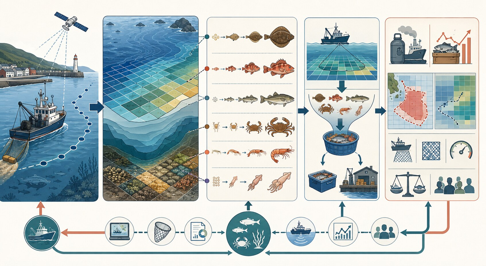
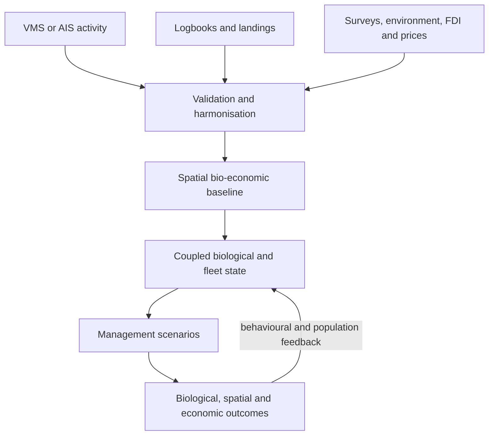
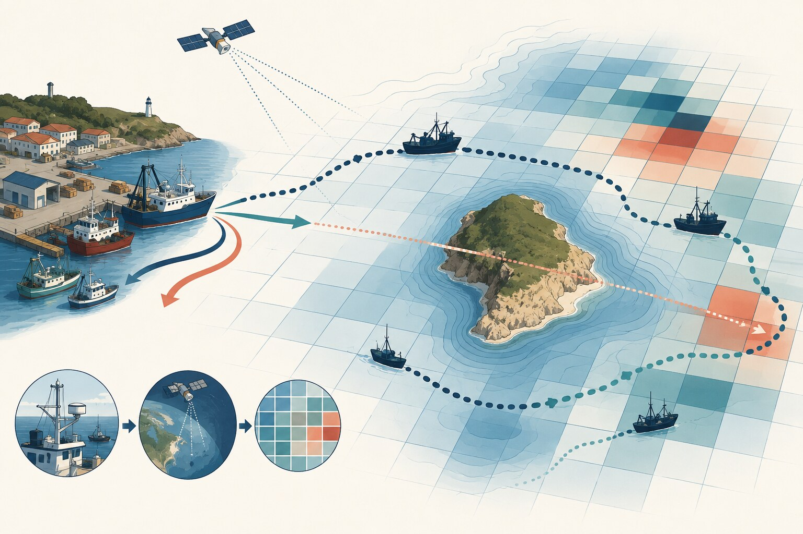
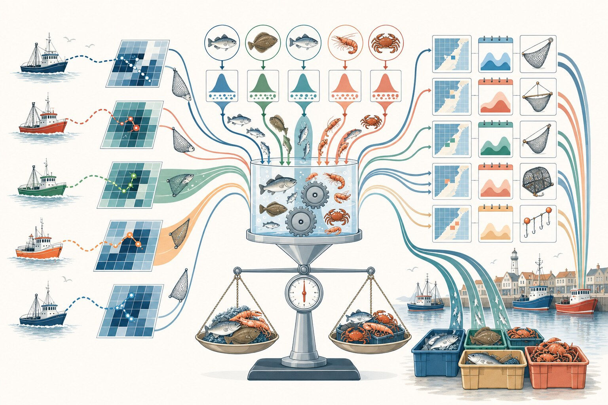
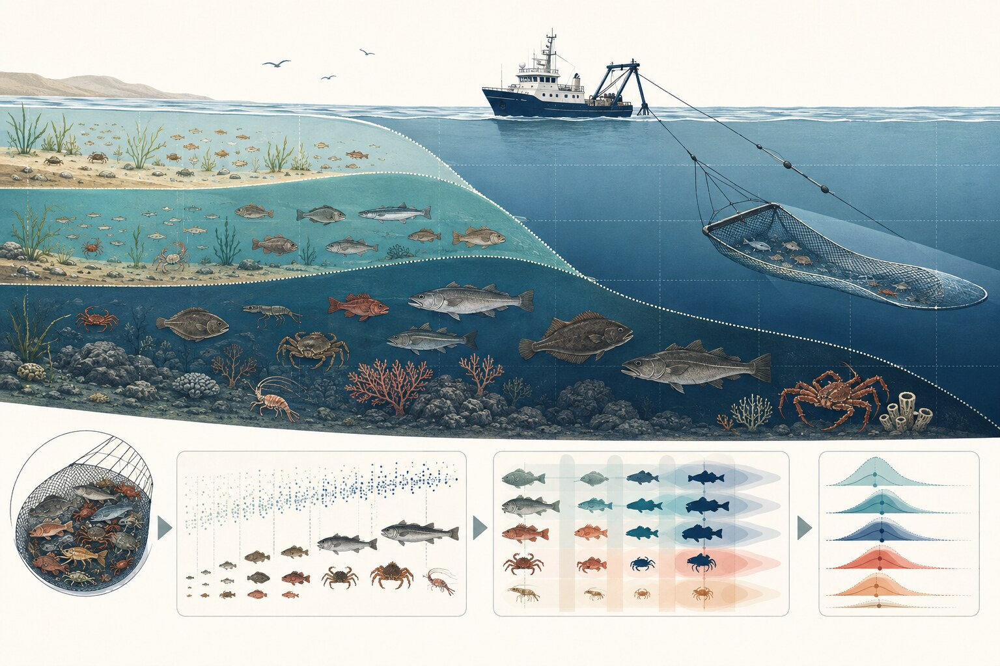
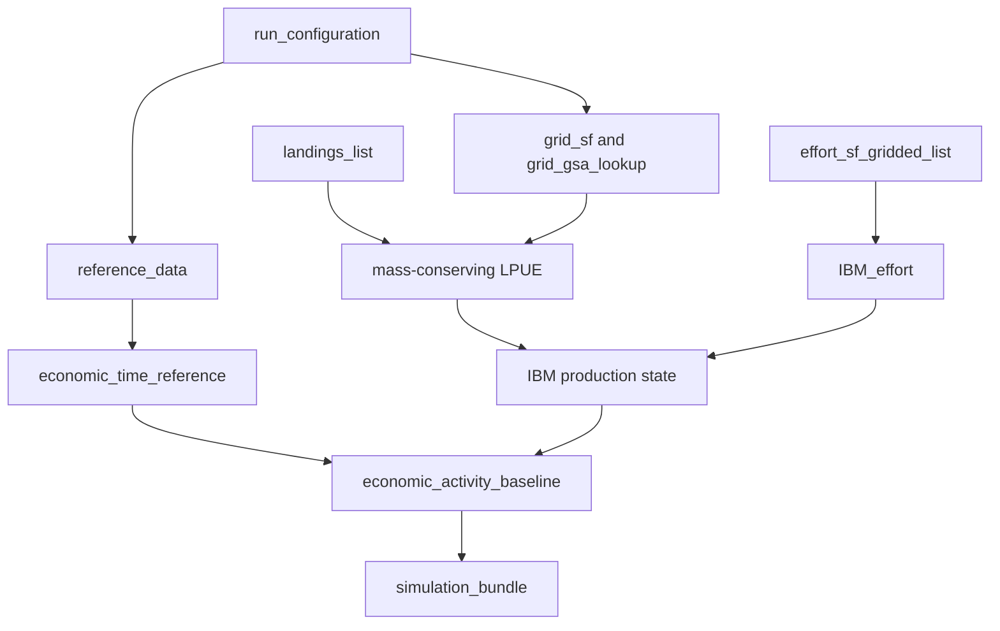

<p align="center">
  
</p>

# SMART3.1

### Spatially explicit, age-aware and bio-economic modelling for fisheries management

[](https://www.r-project.org/)
[](#development-status)
[](LICENSE)

**SMART3.1** is a modular research workflow for reconstructing spatial fisheries dynamics and evaluating management strategies. It integrates vessel activity, landings, biological surveys, environmental information and fleet economics within a coherent spatial and temporal framework.

The central idea is that fishing pressure, resource distribution and fleet behaviour interact in space. Management measures should therefore be assessed not only by how much effort they remove, but also by **where and when effort is displaced**, which population components are affected, and how fleets respond economically.

<p align="center">
  
</p>

> SMART3.1 is under active development. The complete Step 1 research workflow now constructs and validates a spatial bio-economic baseline, including mass-conserving production, age structure, vessel economics and a versioned simulation hand-off. Migration of that implementation into documented, testable and reusable public modules is continuing.

## Scientific scope

SMART was originally developed as a spatially explicit bio-economic model for demersal trawl fisheries. SMART3.1 extends that architecture into a more general and auditable workflow designed to support multi-species and multi-gear case studies.

The framework links five interacting dimensions:

1. **Fishing activity** — vessel movements, fishing time, steaming, gear, fleet structure and access to fishing grounds.
2. **Production** — calibrated landings, spatial LPUE and the origin-to-harbour flow of catches.
3. **Population structure** — species distributions, habitat constraints and depth-dependent catch composition by age.
4. **Fleet economics** — revenues, days at sea, fuel consumption, operating costs and profitability.
5. **Management response** — effort reallocation and biological-economic feedback under alternative spatial, temporal and capacity measures.

SMART3.1 is intended as a **decision-support and Management Strategy Evaluation framework**, not as a substitute for stock assessment. Its role is to connect assessed or reconstructed biological states with fleet spatial behaviour and the consequences of management choices.

## End-to-end workflow



### 1. Configure the case study

A case study defines years, species, gears, geographical subareas, spatial resolution and model settings. Reference tables are loaded into a named object rather than injected into the global environment. Keys, units, ranges and unresolved validation issues are checked before analytical processing begins.

### 2. Reconstruct fleet activity and accessibility

Vessel positions are classified and interpolated into fishing activity, then aggregated over a common spatial grid. Boundary cells are assigned to the General Fisheries Commission for the Mediterranean geographical subarea (GSA) with the largest intersected area. Navigational distances between harbours and fishing grounds are calculated over water rather than as straight lines across land.

<p align="center">
  
</p>

### 3. Estimate spatial LPUE and conserve catch mass

Within each year-month-area-species-gear stratum, non-negative least squares estimates a vector of spatial catch rates:

$$
\widehat{\boldsymbol{\lambda}}
=\arg\min_{\boldsymbol{\lambda}\geq 0}
\left\|\mathbf{A}\boldsymbol{\lambda}-\mathbf{c}\right\|_2^2,
$$

where $\mathbf{A}$ represents gridded vessel effort and $\mathbf{c}$ contains calibrated vessel catches. The final allocation is normalised within each stratum so that

$$
\sum_i E_{k,i}\widehat{\lambda}_{k,i}=C_k,
$$

where $C_k$ is the calibrated catch target. This guarantees non-negative production and explicit conservation of landings mass.

Fallbacks are hierarchical, restricted and labelled. When declared catch has no target-year VMS support, SMART3.1 preserves it as an explicit non-VMS biological removal rather than inventing vessel effort, trips or economic costs.

<p align="center">
  
</p>

### 4. Reconstruct catch composition by age and habitat

Survey length-frequency and biomass observations are combined with stock-specific growth and length-weight parameters. A depth-dependent model modifies the marginal age composition for each species and spatial cell:

$$
p_{a,i}=
\frac{\pi_a r_a(d_i)}
{\sum_{a^\prime}\pi_{a^\prime}r_{a^\prime}(d_i)},
\qquad \sum_a p_{a,i}=1,
$$

where $\pi_a$ is the baseline contribution of age $a$ and $r_a(d_i)$ is its relative response at the depth of cell $i$. Spatial measures can therefore affect juveniles, adults and spawning biomass differently.

<p align="center">
  
</p>

### 5. Assemble the vessel-level bio-economic state

The activity-level model connects vessels, months, gears, fishing grounds, harbours, effort, production and prices. Economic calculations are performed once per activity before any species or age expansion, preventing effort and costs from being replicated.

Total gross value of landings is separated into a scenario-sensitive six-species component and the FDI-derived residual for other species:

$$
GVL^{total}_{i,t,s}=GVL^{6sp}_{i,t,s}+GVL^{other,ref}_{i,t}.
$$

The six-species value changes with simulated production; the residual is fixed at its vessel reference value unless a scenario explicitly changes that assumption. The accounting identities are

$$
GVA=GVL^{total}-EC-OC,
\qquad
GP=GVA-LC,
\qquad
GPM=\frac{GP}{GVL^{total}}.
$$

FDI days at sea provide the annual activity constraint. They are allocated to vessel-month records using observed VMS activity shares. Annual reference strata that imply physically impossible activity, including more than 24 fishing hours per day at sea, are excluded from direct calibration and replaced through a labelled hierarchy:

1. GSA × gear × vessel-length class;
2. gear × vessel-length class;
3. gear.

Days at sea remain fixed in a scenario, while steaming time responds to water-constrained harbour-to-cell distance and fishing hours respond through an explicit elasticity parameter. For gears with a physical fuel model, fuel is separated into fishing and steaming components:

$$
FC=q^{fish}H^{fish}+q^{steam}H^{steam}.
$$

The hourly rates are normalised to reproduce the reference daily consumption. The current OTB starting ratio uses the OTB02 rates reported by Sala et al. (2022): 72.8 l h$^{-1}$ while towing and 66.0 l h$^{-1}$ while steaming. Where no gear-specific physical model is available, the energy-cost share remains an explicit accounting equivalent rather than an invented fuel process.

### 6. Simulate management strategies

Alternative scenarios can modify fishing capacity, total effort, fishing seasons, spatial access or combinations of these measures. Fleet activity is reallocated subject to scenario constraints, after which biological and economic states are updated and reconciled against the verified baseline.

<p align="center">
  
</p>

## Principal objects and their relationships

The diagram describes the target object architecture of the complete SMART3.1 workflow. Some objects remain in the research implementation while their public modular counterparts are developed.



| Object | Role | Principal key or resolution |
|---|---|---|
| `run_configuration` | Reproducible case-study selections and settings | Run level |
| `reference_data` | Validated prices, fleet, species, depth, harbour and economic tables | Named list of explicit datasets |
| `grid_sf` | Spatial grid and case-study geometry | `id_grid` |
| `grid_gsa_lookup` | Exact grid-cell assignment to the dominant GSA overlap | `id_grid` |
| `effort_sf_gridded_list` | Vessel-level gridded activity | Vessel × year × month × gear × cell |
| `landings_list` | Calibrated vessel-level landings | Vessel × year × month × species × gear × area |
| `df_lpue_rates_mass_conserving` | Sparse, non-negative and mass-conserving LPUE rates | Year × month × area × species × gear × cell |
| `df_prod` | Spatial production, including all biologically allocated catch | Effort × LPUE at cell level |
| `age_proportions` | Depth-dependent catch proportions by age | Area × species × cell × age |
| `IBM_effort` | Unique activity state used for costs and behaviour | Vessel × year × month × gear × cell |
| `IBM` | Species production linked to observed fleet activity | Activity × production month × species |
| `economic_time_reference` | FDI/VMS annual time calibration, exclusions and fallbacks | Year × GSA × gear × vessel-length class |
| `economic_activity_baseline` | Reconciled monthly days, fishing, steaming and fuel components | Vessel × year × month × gear × harbour |
| `economic_scenario_parameters` | Time elasticity and fishing/steaming fuel parameters | Gear or scenario level |
| `vessel_other_gvl_reference` | Fixed FDI residual for non-modelled species | Vessel × year × gear |
| `IBM.eco.annual` | Annual vessel-economic indicators | Vessel × year × gear × harbour |
| `non_vms_landings_ledger` | Declared catch without target-year VMS support | Catch stratum; biological removal only |
| `simulation_bundle` | Versioned and validated hand-off to scenario simulation | Run level, with manifest and checksums |

## Validation and diagnostics

SMART3.1 treats validation as part of the model rather than as post-processing. The Step 1 hand-off is blocked when it detects unresolved failures in keys, units, coverage, mass balance, economic identities or physical activity constraints.

The validated workflow currently checks, among other conditions:

- exact reconciliation of calibrated catch and spatial production;
- exact reproduction of production mass and six-species GVL after economic aggregation;
- the identity $GVL^{total}=GVL^{6sp}+GVL^{other,ref}$;
- complete LPUE, price, harbour-distance and economic-rate coverage;
- finite and physically admissible days-at-sea, trip-rate and activity-hour references;
- explicit reporting of FDI exclusions and every fallback level used;
- one-time accounting of fuel and costs at activity or vessel-month level;
- versioned output manifests and checksums.

Values are not silently truncated or imputed to force completion. Diagnostics identify failed segments and preserve the annual VMS–FDI components needed to resolve them.

## Design principles

- **Spatially explicit by construction** — grid cell and biological area remain part of analytical keys.
- **Mass conserving** — every calibrated catch target is reconciled against spatial production.
- **Non-negative** — LPUE and production cannot become negative through model fitting.
- **Age aware** — catch composition responds to habitat and depth rather than relying only on pooled age vectors.
- **Economically coherent** — effort, days, fuel and costs are calculated once at the appropriate activity scale.
- **Transparent fallback hierarchy** — weak or invalid support is classified, diagnosed and never silently imputed.
- **Fail-fast validation** — invalid keys, units, duplicates, missing coverage and failed reconciliation stop the workflow.
- **Auditable outputs** — versions, manifests, checksums and diagnostic tables accompany simulation inputs.
- **Case-study portability** — study areas, species, gears and years are supplied through configuration rather than embedded in analytical functions.

## Development status

The research implementation of Step 1 now completes the spatial bio-economic baseline and produces a validated simulation archive. This includes:

- reference-data preparation and strict validation;
- water-constrained accessibility and dominant-overlap GSA assignment;
- calibrated landings and mass-conserving spatial LPUE;
- depth-dependent catch composition by age;
- activity-linked vessel production;
- FDI-calibrated days at sea and vessel-month activity;
- dynamic six-species revenue plus a fixed non-modelled-species reference residual;
- fishing/steaming fuel accounting and annual economic indicators;
- fail-fast biological, spatial and economic reconciliation;
- versioned export of baseline objects, diagnostics and scenario parameters.

The public repository remains an **active development codebase**, not a stable software release. Refactoring, tests, reusable functions, example configurations and documentation are being migrated incrementally from the complete research notebook.

## Repository contents

- [`R/load_reference_data.R`](R/load_reference_data.R) — strict loader for standardised reference datasets.
- [`data-raw/prepare_reference_data.R`](data-raw/prepare_reference_data.R) — reproducible conversion and validation of legacy inputs.
- [`docs/reference-data/README.md`](docs/reference-data/README.md) — preparation workflow and publication decisions.
- [`docs/reference-data/data_dictionary.csv`](docs/reference-data/data_dictionary.csv) — field definitions, units and key roles.
- [`docs/reference-data/validation_report.md`](docs/reference-data/validation_report.md) — resolved issues, warnings and methodological limitations.

Raw fleet, vessel, price and provider-restricted economic data are not distributed automatically. Users are responsible for access rights, confidentiality, licences and case-study-specific validation.

## Current quick start: reference data

From the repository root:

```bash
Rscript data-raw/prepare_reference_data.R \
  data-raw/SMART31_reference_inputs_raw.RData \
  data/reference \
  GSA12,GSA13,GSA14,GSA15,GSA16
```

Then load the validated outputs without populating the global environment:

```r
source("R/load_reference_data.R")

reference_data <- load_reference_data(
  data_dir = "data/reference",
  strict = TRUE
)
```

`strict = TRUE` is deliberate: unresolved validation errors block downstream analysis. Use `strict = FALSE` only for diagnostic inspection while source problems are being resolved.

## Reproducibility and data governance

SMART3.1 separates source data, standardised analytical inputs, diagnostics and model outputs. A complete case study should record:

- source, version, licence and units for every external dataset;
- the exact configuration and spatial reference system;
- object and model version identifiers;
- mass-balance and economic reconciliation results;
- an output manifest and file checksums;
- any catch retained as a non-VMS biological removal;
- all justified transfers, fallbacks or exclusions.

This repository does not confer permission to redistribute third-party or confidential fisheries data. The repository licence applies to material owned by the repository authors, not automatically to external inputs.

## AI-assisted development

ChatGPT and Codex by OpenAI contributed to the development and documentation process through:

- review and modularisation of R code;
- design of validation and reconciliation workflows;
- methodological documentation, formulas and diagrams;
- detection and correction of implementation errors;
- language revision and restructuring of this README.

Scientific assumptions, methodological decisions, source-data validation and final responsibility for SMART3.1 remain with the project author and collaborators. AI assistance is documented for transparency and does not replace scientific review, reproducibility checks or domain accountability.

## Scientific lineage

SMART3.1 builds on the original SMART bio-economic framework, the integration of landings and VMS data, multi-species simulation of management measures, and the modular `smartR` implementation.

### References

- Russo, T. et al. (2014). **SMART: A Spatially Explicit Bio-Economic Model for Assessing and Managing Demersal Fisheries, with an Application to Italian Trawlers in the Strait of Sicily.** *PLoS ONE*, 9(1), e86222. [https://doi.org/10.1371/journal.pone.0086222](https://doi.org/10.1371/journal.pone.0086222)
- Russo, T. et al. (2018). **A model combining landings and VMS data to estimate landings by fishing ground and harbor.** *Fisheries Research*, 199, 218–230. [https://doi.org/10.1016/j.fishres.2017.11.002](https://doi.org/10.1016/j.fishres.2017.11.002)
- Russo, T. et al. (2019). **Simulating the Effects of Alternative Management Measures of Trawl Fisheries in the Central Mediterranean Sea: Application of a Multi-Species Bio-economic Modeling Approach.** *Frontiers in Marine Science*, 6, 542. [https://doi.org/10.3389/fmars.2019.00542](https://doi.org/10.3389/fmars.2019.00542)
- D'Andrea, L. et al. (2020). **smartR: An R package for spatial modelling of fisheries and scenario simulation of management strategies.** *Methods in Ecology and Evolution*. [https://doi.org/10.1111/2041-210X.13394](https://doi.org/10.1111/2041-210X.13394)
- Sala, A. et al. (2022). **Energy audit and carbon footprint in trawl fisheries.** *Scientific Data*, 9, 428. [https://doi.org/10.1038/s41597-022-01478-0](https://doi.org/10.1038/s41597-022-01478-0)

## Citation

Until a dedicated SMART3.1 software release and `CITATION.cff` are published, cite the methodological paper or papers corresponding to the modules used. When reporting a SMART3.1 application, also record the repository commit, case-study configuration and analytical-output version.

## Contributing

SMART3.1 is research software under active development. Contributions are welcome through [GitHub issues](https://github.com/tommaso-russo/SMART3.1/issues), particularly for reproducible configurations, legally shareable validation data, tests, documentation and performance improvements that preserve numerical and mass-balance safeguards.

## Licence

Repository-owned code and documentation are released under [CC0 1.0 Universal](LICENSE), unless otherwise stated. External data, scientific publications and provider-derived parameters remain subject to their original terms and permissions.

---

The conceptual illustrations in this README were prepared specifically for SMART3.1. They are explanatory graphics rather than maps, measurements or quantitative model outputs.
